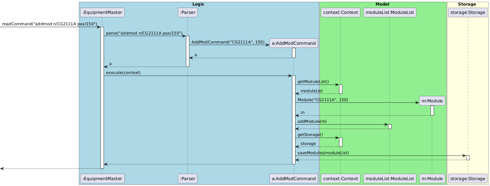

# Developer Guide

## Acknowledgements

{list here sources of all reused/adapted ideas, code, documentation, and third-party libraries -- include links to the original source as well}

## Design & implementation

### SetBufferCommand

Sets a buffer percentage on a named equipment item. The buffer is persisted to storage.


**Format:** `setbuffer n/<name> b/<percentage>[%]`

**Behaviour:**
- The `%` symbol in the buffer value is optional and stripped during parsing
- If the equipment name is not found, an error message is shown and no change is made
- Buffer percentage defaults to `0.0` when equipment is first added

**Example:**
```
setbuffer n/STM32 b/10%
setbuffer n/STM32 b/10
```
 
---

### SetStatusCommand

Updates the loaned or available count of an equipment item. Can target equipment by name or by 1-based index.


**Format:**
- `setstatus n/<name> <count> loaned` — loans out `<count>` units, decreasing available
- `setstatus n/<name> <count> available` — returns `<count>` units, increasing available
- `setstatus <index> <count> loaned/available` — same as above but targets by 1-based list index

**Constraints:**
- Negative counts are rejected silently — no change is made
- Count must not exceed current available (when loaning) or current loaned (when returning)

**Example:**
```
setstatus n/BasyS3 FPGA 5 loaned
setstatus 1 3 available
```

---

### Enhanced Find Feature

#### 1. Overview
The Enhanced Find Feature allows users to search the inventory not only by the equipment's name but also by its associated course module codes. This ensures that users can quickly locate all equipment required for a specific class (e.g., searching "CG2111A" to find all related microcontrollers, sensors, and cables).

#### 2. Implementation Details
The feature is facilitated by the `FindCommand` class. During a recent refactoring phase, the execution logic was heavily optimized to adhere to the **Single Level of Abstraction Principle (SLAP)** and to eliminate deeply nested code structures (the "Arrow Anti-Pattern").

The execution follows these steps:
1. The user inputs a command string (e.g., `find STM32 CG2111A`).
2. The `Parser` parses the string, splits the keywords, and returns a `FindCommand` object.
3. The main application loop calls `FindCommand#execute(Context)`.
4. Inside `execute()`, the command extracts the `EquipmentList` and `Ui` from the `Context`.
5. It calls a helper method `getMatchingEquipments(EquipmentList)` which handles the iteration logic.
6. For each `Equipment`, it delegates the low-level string comparison to a private method `isMatchFound(Equipment, String[])`.
7. `isMatchFound()` utilizes **guard clauses** and **early returns**. If a token matches either the equipment's name or its module list, it immediately returns `true`, preventing duplicate additions without needing complex collections like `Set`.
8. The matched equipment is collected into an `ArrayList` and passed to the `Ui` for display.

#### 3. Sequence Diagram
The following sequence diagram illustrates the interactions between the Logic and Model components. It highlights the delegation of matching logic to helper methods (`getMatchingEquipments` and `isMatchFound`) to maintain a clean level of abstraction.


#### 4. Design Considerations
**Alternative 1 (Current Implementation): Extracted Helpers & Early Returns (SLAP)**
* **How it works:** The high-level iteration and low-level string matching are separated into different methods. Inside the matching method, as soon as one token matches the name or module code, it returns `true` and stops checking further tokens for that equipment.
* **Why it was chosen:** Highly performant and readable. It natively solves the deduplication problem (ensuring an equipment item is added to the results list exactly once) by failing fast/succeeding fast. It removes deep nesting, making the codebase highly testable and compliant with clean code standards.

**Alternative 2: Deeply Nested Iteration with `break` Statements**
* **How it works:** A single large `getMatchingEquipments` method contains nested `for` loops (looping through equipment, then tokens, then module codes). It uses `break` to exit the loop once a match is found and checks `matchedList.contains(eq)` before adding to prevent duplicates.
* **Why it was rejected:** This implementation suffers from the "Arrow Anti-Pattern" (excessive indentation), making the code extremely difficult to trace and maintain. Furthermore, relying on `ArrayList.contains()` for a dynamically growing list introduces unnecessary $O(N)$ overhead compared to the $O(1)$ early return mechanism used in the current design.

---

### Module Tracking System

#### 1. Overview
The Module Tracking System allows users to manage a registry of academic course modules (e.g., `CG2111A`) and their respective student enrollment sizes (pax). This enhancement enables better tracking of equipment allocation by linking lab inventory to specific modules.

#### 2. Implementation Details
The feature is implemented using a centralized `ModuleList` that stores `Module` objects. It interacts closely with the `Storage` component to ensure data persistence across sessions.

Given the recent architectural refactoring, the system utilizes the **Context Object Pattern** to manage dependencies. When a user inputs a module-related command (e.g., `addmod`), the following execution flow occurs:

1. The user enters `addmod n/CG2111A pax/150`.
2. The `Parser` identifies the command word and delegates parsing to `AddModCommand.parse()`, which creates an `AddModCommand` object.
3. The main execution loop calls `AddModCommand#execute(Context)`.
4. The command extracts the `ModuleList`, `Ui`, and `Storage` objects from the unified `Context`.
5. A new `Module` object is instantiated and added to the `ModuleList`.
6. The `Storage#saveModules()` method is invoked to persist the updated list to `data/module.txt`.
7. The `Ui` displays a success confirmation to the user.

#### 3. Sequence Diagram
The following sequence diagram illustrates the interactions between the Logic, Model, and Storage components when the `addmod` command is executed:



#### 4. Design Considerations
**Alternative 1 (Current Implementation): Normalized Data Structure**
* **How it works:** Modules and their capacities are stored in a standalone `ModuleList`. Equipment objects store only the names (Strings) of the modules they are used in.
* **Why it was chosen:** This follows the database normalization principle. If a module's enrollment size changes (via `updatemod`), we only need to update it in one place (`ModuleList`). It avoids traversing the entire `EquipmentList`.

**Alternative 2: Embedding Module Details within Equipment**
* **How it works:** Each `Equipment` object contains a list of fully instantiated `Module` objects (including name and pax).
* **Why it was rejected:** This creates massive data redundancy. If `CG2111A` uses 10 different types of equipment, the enrollment number `150` would be saved 10 times. Updating the enrollment would require an $O(N)$ search through all equipment, increasing the risk of inconsistent data state.

---

### Aging Equipment Report

#### 1. Overview
The Aging Equipment Report feature allows lab technicians to proactively identify equipment that has exceeded its expected lifespan. Instead of using arbitrary calendar dates, the system calculates age dynamically based on the semantic university timeline (Academic Semesters).

#### 2. Implementation Details
The feature is driven by the `ReportCommand` class. It relies on the `AcademicSemester` class to perform semantic time-difference calculations.

The execution flow is as follows:
1. The user enters `report aging`.
2. The `Parser` returns a `ReportCommand` initialized with the `"aging"` report type.
3. During `execute(Context)`, the command extracts the global `currentSemester` and the `EquipmentList` from the `Context`.
4. It iterates through all equipment in the list. For each equipment that has a recorded `purchaseSemester`, it calculates the elapsed time by calling `AcademicSemester#calculateAgeInYears(currentSemester)`.
5. The calculated age is compared against the equipment's defined `lifespan`.
6. If the age is close to or exceeds the lifespan, the equipment is appended to a temporary report list.
7. Finally, the `Ui` formats and prints the curated report.

#### 3. Sequence Diagram
The following sequence diagram details the object interactions during the generation of an aging report. Self-calls and minor UI formatting steps have been omitted for clarity.


#### 4. Design Considerations
**Alternative 1 (Current Implementation): Semantic Academic Timekeeping**
* **How it works:** Time is tracked using `AcademicSemester` objects (e.g., `AY2024/25 Sem1`). The age is calculated mathematically by assuming each semester represents 0.5 years.
* **Why it was chosen:** Lab equipment procurement, deployment, and auditing cycles are tightly bound to university semesters. Tracking age via `AY` aligns perfectly with the user's domain reality, making data entry and reporting highly intuitive for student TAs and lab staff.

**Alternative 2: Standard Date/Time Libraries**
* **How it works:** Utilizing `java.time.LocalDate` to record exact purchase dates and calculating the precise number of days elapsed.
* **Why it was rejected:** While `LocalDate` is standard, it requires users to input precise formats (e.g., `YYYY-MM-DD`). In practice, lab technicians often only remember the semester an item was bought (e.g., "We got this batch last Sem 1"). Enforcing exact dates adds unnecessary friction to the data entry process.

---

### Procurement Report (Automated Restocking)

#### 1. Overview
The Procurement Report is a computed report that calculates recommended semesterly purchase quantities. It aggregates demand from enrolled student numbers across different modules, applies a configured safety buffer, and compares the result against current stock to produce a "To Buy" list.

#### 2. Implementation Details
The feature is integrated into the existing `ReportCommand` class to group all analytical logic in one place. The core logic resides in the `executeProcurementReport(Context)` method.

The calculation follows this strict algorithm for each equipment item:
1.  **Demand Aggregation**: The system iterates through the `moduleCodes` list associated with the equipment. It retrieves the latest enrollment numbers (pax) from the `ModuleList` and sums them up to determine the `Base Demand`.
    *   *Orphaned Tag Handling*: If a module code exists in the equipment's tag list but has been deleted from the `ModuleList`, it is gracefully ignored to prevent `NullPointerException`.
2.  **Buffer Application**: The `Base Demand` is multiplied by `(1 + bufferPercentage / 100.0)`.
3.  **Indivisibility Rule**: The result is rounded up to the nearest whole number using `Math.ceil()`. You cannot purchase 0.5 of a board.
4.  **Gap Analysis**: The system subtracts the *Total Quantity* (owned inventory) from the *Total Required*.
    *   Note: It uses *Total Quantity* rather than *Available Quantity* because procurement decisions are based on total asset ownership, regardless of whether items are currently loaned out.
5.  **Output**: If `To Buy > 0`, the item is flagged in the report.

#### 3. Design Considerations
**Alternative 1 (Current Implementation): Total Ownership vs. Demand**
*   **How it works:** `To Buy = Required - Total_Quantity`.
*   **Why it was chosen:** This is the correct accounting approach. If 10 items are needed, and we own 10 but 5 are loaned out, we do *not* need to buy more. We just need to wait for returns. Using `Available` would lead to massive over-purchasing during active semesters.

**Alternative 2: Available Stock vs. Demand**
*   **How it works:** `To Buy = Required - Available_Quantity`.
*   **Why it was rejected:** As mentioned above, this leads to double-purchasing. If an item is temporarily loaned, it is still an asset we own. Procurement budgets should only be spent on actual inventory deficits, not temporary shortages.

---

### `UiTable`: Dynamic UI Table Generation Utility

#### 1. Overview
As Equipment Master is a Command Line Interface (CLI) application, presenting structured data (such as inventory lists or command help tables) in a readable format is a significant challenge. The **Dynamic UI Table Generation** feature provides a reusable component `UiTable` and `UiTableRow` to automatically format and align variable-length data into neat, spreadsheet-like views. This component is heavily utilized by commands like `ListCommand` and `HelpCommand`.

#### 2. Implementation Details
The feature is implemented through two key classes in the `ui` package: `UiTable` and `UiTableRow`.

*   **`UiTableRow`**: Represents a single row of data. It serves as an adapter, accepting raw strings or domain objects (like `Equipment`) and converting them into a list of cell values. It also handles the low-level string padding logic.
*   **`UiTable`**: Acts as the layout engine. It collects multiple `UiTableRow` objects and calculates the maximum width required for each column by scanning all rows. This ensures that columns are perfectly aligned regardless of the data length.

When `ListCommand` is executed:
1.  It instantiates a new `UiTable`.
2.  It streams the `EquipmentList` and maps each `Equipment` object into a `UiTableRow`.
3.  Each row is added to the table.
4.  Finally, `table.toString()` is called. This triggers the calculation of column widths (`getColumnWidth`) and the generation of the final formatted string with indices and separators.

Similarly, `HelpCommand` utilizes `UiTable` but enables the `hasHeader` flag, allowing it to render a title row ("Command" | "Format") without the auto-generated numeric index.

#### 3. Class Diagram

---

## Product scope
### Target user profile

{Describe the target user profile}

### Value proposition

**Equipment Master** is a fast, text-based desktop application designed to digitize and streamline laboratory inventory management. Built specifically for university lab technicians managing high-traffic innovation spaces, it replaces fragile, error-prone paper logs with a secure, highly accountable digital system.

Whether you are managing shared pools of STM32 boards across different modules (e.g., EE2028, CG2028), allocating Basys3 boards for EE2026, or tracking general accessories like HDMI cables, Equipment Master ensures you always know exactly what you have and who has it.

**Why use Equipment Master?**
* **Ditch the Paper:** Transition from disorganized physical folders to a searchable, secure digital ledger.
* **Rapid CLI Workflow:** Designed for fast typists. Log check-outs and returns in seconds using simple text commands, avoiding clunky GUI menus.
* **Module-Specific Tracking:** Easily associate equipment with specific academic modules to track usage and allocations accurately.
* **100% Accountability:** Precisely track borrower identities and monitor equipment availability to eliminate the loss of high-value lab assets.

## User Stories

|Version| As a ... | I want to ... | So that I can ...|
|--------|----------|---------------|------------------|
|v1.0|new user|see usage instructions|refer to them when I forget how to use the application|
|v2.0|user|find a to-do item by name|locate a to-do without having to go through the entire list|

## Non-Functional Requirements

{Give non-functional requirements}

## Glossary

* *glossary item* - Definition

## Instructions for manual testing

{Give instructions on how to do a manual product testing e.g., how to load sample data to be used for testing}
