# Developer Guide

## Table of Contents<!-- TOC -->
* [Developer Guide](#developer-guide)
  * [Table of Contents](#table-of-contents)
  * [Acknowledgements](#acknowledgements)
  * [Design & implementation](#design--implementation)
    * [Architecture Interaction: The Context Object Pattern](#architecture-interaction-the-context-object-pattern)
      * [Object Snapshot: The Internal State](#object-snapshot-the-internal-state)
    * [Defensive Programming and Error Handling](#defensive-programming-and-error-handling)
      * [1. Centralized Exception Handling](#1-centralized-exception-handling)
      * [2. Guard Clauses in Parsing](#2-guard-clauses-in-parsing)
      * [3. Use of Assertions](#3-use-of-assertions)
      * [4. Safe Data Persistence](#4-safe-data-persistence)
    * [Parser Component (Command Factory Pattern)](#parser-component-command-factory-pattern)
      * [1. Overview](#1-overview)
      * [2. Architecture and Usage](#2-architecture-and-usage)
      * [3. UML Class Diagram](#3-uml-class-diagram)
      * [4. Design Considerations](#4-design-considerations)
    * [Core Inventory Ingestion (`AddCommand`)](#core-inventory-ingestion-addcommand)
      * [1. Overview](#1-overview-1)
      * [2. Implementation Details](#2-implementation-details)
      * [3. UML Diagrams](#3-uml-diagrams)
      * [4. Design Considerations](#4-design-considerations-1)
      * [5. Current Limitations & Future Improvements](#5-current-limitations--future-improvements)
    * [Delete Feature (Equipment & Module)](#delete-feature-equipment--module)
      * [1. Overview](#1-overview-2)
      * [2. Component-level implementation (Equipment Deletion)](#2-component-level-implementation-equipment-deletion)
      * [3. Design Considerations](#3-design-considerations)
      * [4. Current Limitations & Future Improvements](#4-current-limitations--future-improvements)
    * [Storage Implementation](#storage-implementation)
      * [1. Data Format](#1-data-format)
      * [2. Loading Logic (The "Robust Loader")](#2-loading-logic-the-robust-loader)
      * [3. Design Considerations](#3-design-considerations-1)
    * [SetBufferCommand](#setbuffercommand)
      * [1. Overview](#1-overview-3)
      * [2. Implementation Details](#2-implementation-details-1)
      * [3. Sequence Diagram](#3-sequence-diagram)
      * [4. Design Considerations](#4-design-considerations-2)
    * [SetStatusCommand](#setstatuscommand)
      * [1. Overview](#1-overview-4)
      * [2. Implementation Details](#2-implementation-details-2)
      * [3. Sequence Diagram](#3-sequence-diagram-1)
      * [4. Design Considerations](#4-design-considerations-3)
    * [Low Stock Alert System](#low-stock-alert-system)
      * [1. Overview](#1-overview-5)
      * [2. Implementation Details](#2-implementation-details-3)
      * [3. Sequence Diagram](#3-sequence-diagram-2)
      * [4. Design Considerations](#4-design-considerations-4)
    * [Enhanced Find Feature](#enhanced-find-feature)
      * [1. Overview](#1-overview-6)
      * [2. Implementation Details](#2-implementation-details-4)
      * [3. UML Diagrams](#3-uml-diagrams-1)
      * [4. Design Considerations](#4-design-considerations-5)
      * [5. Current Limitations & Future Improvements](#5-current-limitations--future-improvements-1)
    * [Module Tracking System](#module-tracking-system)
      * [1. Overview](#1-overview-7)
      * [2. Implementation Details](#2-implementation-details-5)
      * [3. UML Diagrams](#3-uml-diagrams-2)
      * [4. Design Considerations](#4-design-considerations-6)
      * [5. Future Implementations (Beyond v2.1)](#5-future-implementations-beyond-v21)
    * [Academic Dependency Mapping (`TagCommand` & `UntagCommand`)](#academic-dependency-mapping-tagcommand--untagcommand)
      * [1. Overview](#1-overview-8)
      * [2. Implementation Details](#2-implementation-details-6)
      * [3. Sequence Diagrams: Tag and Untag Execution](#3-sequence-diagrams-tag-and-untag-execution)
      * [4. Design Considerations](#4-design-considerations-7)
    * [Implementation: Safe Dereferencing (Data Integrity)](#implementation-safe-dereferencing-data-integrity)
      * [1. Execution Logic](#1-execution-logic)
      * [2. Design Considerations](#2-design-considerations)
    * [Aging Equipment Report](#aging-equipment-report)
      * [1. Overview](#1-overview-9)
      * [2. Implementation Details](#2-implementation-details-7)
      * [3. UML Diagrams](#3-uml-diagrams-3)
      * [4. Design Considerations](#4-design-considerations-8)
      * [5. Future Implementations (Beyond v2.1)](#5-future-implementations-beyond-v21-1)
    * [Implementation: Academic Semester Normalization](#implementation-academic-semester-normalization)
      * [1. The Normalization Algorithm](#1-the-normalization-algorithm)
      * [2. Usage in Aging Calculation](#2-usage-in-aging-calculation)
    * [Procurement Report (Automated Restocking)](#procurement-report-automated-restocking)
      * [1. Overview](#1-overview-10)
      * [2. Implementation Details](#2-implementation-details-8)
      * [3. Sequence Diagram: Procurement Report Execution](#3-sequence-diagram-procurement-report-execution)
      * [4. Design Considerations](#4-design-considerations-9)
      * [5. The Calculation Pipeline](#5-the-calculation-pipeline)
      * [6. Current Limitations & Future Improvements](#6-current-limitations--future-improvements)
    * [`UiTable`: Dynamic UI Table Generation Utility](#uitable-dynamic-ui-table-generation-utility)
      * [1. Overview](#1-overview-11)
      * [2. Implementation Details](#2-implementation-details-9)
      * [Rendering Flow (Sequence Diagram)](#rendering-flow-sequence-diagram)
      * [3. Class Diagram](#3-class-diagram)
      * [4. Design Considerations](#4-design-considerations-10)
    * [Help Feature](#help-feature)
      * [1. Overview](#1-overview-12)
      * [2. Component-level implementation](#2-component-level-implementation)
      * [3. Design Considerations](#3-design-considerations-2)
      * [4. Current Limitations & Future Improvements](#4-current-limitations--future-improvements-1)
    * [Logging Architecture](#logging-architecture)
      * [1. Implementation](#1-implementation)
      * [2. Design Considerations](#2-design-considerations-1)
  * [Product scope](#product-scope)
    * [Target user profile](#target-user-profile)
    * [Value proposition](#value-proposition)
  * [User Stories](#user-stories)
    * [Use Cases](#use-cases)
  * [Non-Functional Requirements (NFR)](#non-functional-requirements-nfr)
  * [Glossary](#glossary)
  * [Instructions for Manual Testing](#instructions-for-manual-testing)
    * [1. Launch and Initialization](#1-launch-and-initialization)
    * [2. Loading Sample Data](#2-loading-sample-data)
    * [3. Testing the Enhanced Find Feature](#3-testing-the-enhanced-find-feature)
    * [4. Testing the Aging Equipment Report](#4-testing-the-aging-equipment-report)
    * [5. Testing the Module Tracking System](#5-testing-the-module-tracking-system)
    * [6. Testing Equipment Core Operations (CRUD)](#6-testing-equipment-core-operations-crud)
    * [7. Testing Status, Thresholds, and Buffers](#7-testing-status-thresholds-and-buffers)
    * [8. Testing Additional Reports](#8-testing-additional-reports)
    * [9. Testing Relational Mapping](#9-testing-relational-mapping)
    * [10. Testing Utilities and Context](#10-testing-utilities-and-context)
    * [11. Testing Robustness (Negative Cases)](#11-testing-robustness-negative-cases)
      * [11.1 Invalid Data Input](#111-invalid-data-input)
      * [11.2 Storage Corruption Recovery](#112-storage-corruption-recovery)
      * [11.3 Boundary Values](#113-boundary-values)
  * [Future Roadmap (Beyond v2.1)](#future-roadmap-beyond-v21)
  * [Appendix: Project Effort](#appendix-project-effort)
<!-- TOC --> 

---

## Acknowledgements

* **AddressBook-Level3 (AB3):** This project was initially inspired by and adapted from the AddressBook-Level3 project created by the [SE-EDU initiative](https://se-education.org). We thank the AB3 team for providing a robust architectural template for Java-based CLI applications.
* **Libraries Used:** 
  * [JUnit 5](https://junit.org/junit5/) - For comprehensive unit and integration testing.

---

## Design & implementation

This section describes the overall design of the application and how its main components interact.

**Core Components**
The system is structured into several key components, adhering to the separation of concerns principle:
* **UI**: Manages all user inputs and outputs, formatting text for the Command Line Interface.
* **Parser**: Interprets user input, validates syntax, and constructs the appropriate `Command` objects.
* **Command**: Encapsulates the specific business logic to execute user operations.
* **Model**: Represented internally by `EquipmentList` and `ModuleList`, it stores the runtime inventory data.
* **Storage**: Handles data persistence, reading from and writing to the local `.txt` files.

This modular structure ensures that parsing logic is isolated from execution logic, and data storage is handled independently from the runtime model.


**Architecture: High-Level System Components**
The following diagram illustrates the high-level architecture of the Equipment Master application.
The `EquipmentMaster` class acts as the main entry point. Upon initialization, it utilizes the `Storage` component to load existing data (equipment, modules, and system settings) into memory (`EquipmentList` and `ModuleList`). During execution, it bundles these instantiated components into a single `Context` object.
The application then enters a continuous loop: the `Ui` reads user input, the `Parser` translates this string into a specific executable `Command`, and the `Command` executes its logic by interacting with the shared `Context`.

<div align="center">
  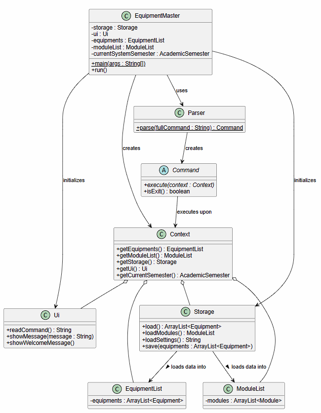
  <p><em>Figure 1: High-level architecture diagram illustrating the core components and their interactions.</em></p>
</div>

---

### Architecture Interaction: The Context Object Pattern
To ensure a clean separation of concerns, the application utilizes a **Context Object Pattern**. Upon startup, all major components (`EquipmentList`, `ModuleList`, `Ui`, `Storage`, `UserPreferences`) are instantiated and bundled into a single `Context` object.

This design choice ensures:
* **Decoupling**: Command objects only interact with the `Context` rather than knowing how the `Ui` or `Storage` is internally structured.
* **Testability**: It allows us to pass a "Mock Context" with temporary storage paths during unit testing.

#### Object Snapshot: The Internal State
To better understand how data is structured in memory during runtime, the following object diagram provides a snapshot of the `Context` object. It shows how `Equipment` items are logically linked to `Module` codes through string-based tagging.

<div align="center">
  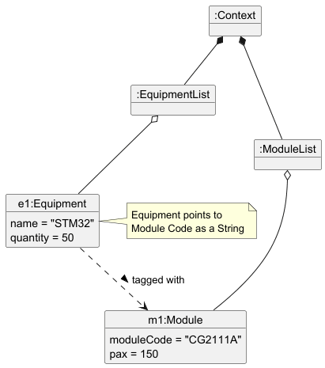
  <p><em>Figure 2: Object diagram snapshot of the Context pattern, showing in-memory data references.</em></p>
</div>

---

### Defensive Programming and Error Handling

To ensure system stability, the application adopts a **Defensive Programming** strategy. The goal is to catch invalid states as early as possible—either during input parsing or immediately before command execution—to prevent the application from entering an inconsistent state.

#### 1. Centralized Exception Handling
The application utilizes a single custom checked exception: **`EquipmentMasterException`**.
* **Role**: It acts as the primary signal for any controlled failure within the application's logic (e.g., malformed user input, missing arguments, or file I/O errors).
* **Execution Flow**: When a `Command` or `Parser` detects an error, it throws an `EquipmentMasterException`. This exception is propagated back to the `Main` execution loop, where the `Ui` catches it and displays a user-friendly error message. This prevents a single error from terminating the entire program.

#### 2. Guard Clauses in Parsing
Before a `Command` object is even instantiated, the `Parser` component utilizes **Guard Clauses** to validate the raw input string.
* **Example**: In `UpdateModCommand#parse`, the system checks for the presence of mandatory flags (`n/`, `pax/`) and validates data types (e.g., ensuring `pax` is a positive integer). If these checks fail, an exception is thrown immediately, ensuring that no "junk" command objects are ever created.

#### 3. Use of Assertions
The application uses **Java Assertions** to document and verify internal assumptions about the program's state during development.
* **Usage**: Assertions are used at the beginning of `execute()` methods to ensure that critical dependencies (like `EquipmentList` or `Ui`) have been correctly injected via the `Context`.
* **Example**: `assert equipments != null : "EquipmentList dependency cannot be null";`
* **Purpose**: Unlike exceptions, these are used to catch **programmer errors** rather than user errors, helping developers identify bugs during the integration phase.

#### 4. Safe Data Persistence
The `Storage` component is designed to be "Fail-Safe." During the loading phase, if a specific line in the save file is corrupted (e.g., contains an illegal character `|`), the system catches the error, logs a warning, and skips only that specific line. This ensures that a single corrupted record does not prevent the user from accessing the rest of their inventory.

---

### Parser Component (Command Factory Pattern)

#### 1. Overview
The `Parser` component acts as the primary gateway for processing user input into executable `Command` objects. It is designed using the **Command Factory Pattern** to ensure high scalability and adherence to the **Open-Closed Principle**.

Developers adding new CLI commands to the application do not need to modify the core parsing loop; they only need to register their new command via a `CommandSpec`.

#### 2. Architecture and Usage
The architecture abstracts the knowledge of *which* command is being requested from *how* that command is parsed and instantiated.

**Key Components:**
1. `CommandFactory` (Functional Interface): Defines a single `parse(String fullCommand)` method signature. Every command class must implement its own parsing logic that matches this signature (typically as a static method).
2. `CommandSpec`: A data class that bundles a command's trigger `keyword` (e.g., `"add"`), its usage `format` string (used primarily by the `help` command), and an instance of `CommandFactory`.
3. `Parser`: Maintains a static, centralized registry (`ArrayList<CommandSpec> commandSpecs`) of all available commands.

**How to Add a New Command:**
When creating a new feature, a developer must:
1. Create the new `Command` class.
2. If the command requires arguments, implement a `public static Command parse(String fullCommand)` method within that class to handle regex validation and argument extraction.
3. Open `Parser.java` and navigate to the static initialization block.
4. Register the new command by adding a `CommandSpec` utilizing Java method references.

**Code Snippet: Command Registration**
```java
static {
    // Registering a Complex Command (requires validation and extraction)
    commandSpecs.add(new CommandSpec("add", "add n/NAME q/QUANTITY...", AddCommand::parse));
    
    // Registering a Simple Command (no arguments needed)
    commandSpecs.add(new CommandSpec("list", "list", fullCommand -> new ListCommand()));
}
```

#### 3. UML Class Diagram
**Class Diagram: Parser Component**

<div align="center">
  
  <p><em>Figure 3: Class diagram of the Parser component utilizing the Command Factory pattern.</em></p>
</div>

#### 4. Design Considerations
* **Command Factory Pattern & Registration**
    * **Justification:** It provides excellent extensibility. By encapsulating parsing and data validation within the specific command classes themselves (e.g., `AddCommand::parse`), the central `Parser` class remains clean. This entirely eliminates bloated dependencies and monolithic `switch-case` statements, heavily reducing merge conflicts when multiple developers add commands simultaneously.

---

### Core Inventory Ingestion (`AddCommand`)

#### 1. Overview

The Core Inventory Ingestion system handles the creation and registration of physical equipment. Because `Equipment` objects can possess a wide variety of optional attributes (such as expected lifespans, specific module tags, and minimum stock alerts), the parsing mechanism must be highly flexible to accommodate complex, single-line CLI inputs without triggering flag collisions.

#### 2. Implementation Details

The `AddCommand` is instantiated via its static `parse` method. The execution flow relies on custom string manipulation to safely extract arguments:

1.  **Space-Padding Extraction:** To prevent substring collisions (e.g., an equipment named "Quantum/Sensor" accidentally triggering an `m/` module flag), the parser uses a space-padding technique in `extractArgument()`. It pads the user input and searches strictly for `" m/"` or `" n/"`.

2.  **Repeating Flag Aggregation:** For tagging multiple modules at creation, `extractMultipleArguments()` iterates through the padded string, identifies every instance of the `" m/"` flag, converts the values to uppercase for standardization, and appends them to an internal list only if they are not already present (using a `results.contains(...)` check) to filter out duplicate inputs while preserving the original order.
 
3.  **Defensive Validation:** The parser strictly rejects names containing reserved storage characters (`|`, `,`, `=`) to prevent save file corruption. Lifespan (`life/`) and purchase semester (`bought/`) are optional flags whose values are only applied when both are provided together; supplying only one of them does not cause a validation error and the partial information is ignored.

4.  **Execution & Save:** Once validated, the `AddCommand` is returned. When executed, it instantiates the `Equipment`, adds it to the `EquipmentList`, and triggers `Storage#save()` to persist the new inventory state.

#### 3. UML Diagrams
**Class Diagram: AddCommand**
(Note: This diagram focuses strictly on the internal structure of `AddCommand` and its inheritance from `Command`. Associated domain classes like `Context`, `Equipment`, and `AcademicSemester` are shown as data types, but their full class definitions are omitted here for clarity.)

<div align="center">
  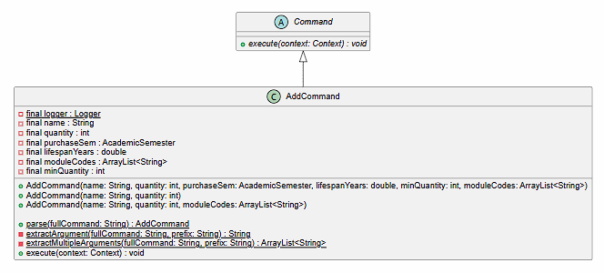
  <p><em>Figure 4: Class diagram detailing the internal structure of the AddCommand.</em></p>
</div>

**Sequence Diagram: Execution Flow**
(Note: This diagram illustrates the `execute()` phase of the command. The initial string parsing and validation steps are handled prior to execution and are omitted for brevity. Storage file I/O operations are shown at a high level.)

<div align="center">
  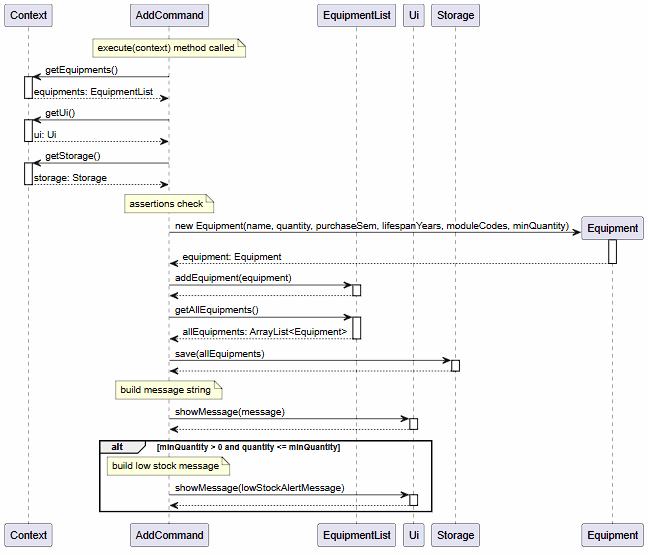
  <p><em>Figure 5: Sequence diagram showing the execution flow of the Core Inventory Ingestion process.</em></p>
</div>

#### 4. Design Considerations

-   **Alternative 1 (Current Implementation): Custom String Parsing with Space-Padding**

  -   **Why it was chosen:** It is lightweight, highly performant, and allows for flexible flag ordering (the user can put `bought/` before or after `m/`). By manually controlling the extraction, we can elegantly handle repeating flags (like multiple modules) without relying on heavy third-party CLI parsing libraries.

-   **Alternative 2: Standard Regex Matching**

  -   **Why it was rejected:** Regex becomes exponentially complex and difficult to maintain when dealing with 5+ optional flags that can appear in any order. A single malformed regex string could break the entire ingestion engine.

#### 5. Current Limitations & Future Improvements
* *Limitation*: The command currently requires all inputs to be typed in a single line, which can be prone to typos for items with many attributes.
* *Improvement*: Support an interactive "wizard" mode (`add --interactive`) that prompts the user step-by-step for each field.

---

### Delete Feature (Equipment & Module)

#### 1. Overview
The delete feature allows users to safely remove physical assets or module registries from the system. Because the application maintains relational links between equipment and modules, the deletion process must prevent "dangling references."

#### 2. Component-level implementation (Equipment Deletion)
When an equipment item is deleted (e.g., `delete n/STM32 q/5 s/AVAILABLE`), the `DeleteCommand` not only updates the quantity but also handles complete removal if the quantity reaches zero.

If an equipment is completely removed from the inventory, the system must perform a reverse-cleanup: it automatically triggers an `untag` operation across all modules to ensure no module still expects a requirement ratio from a non-existent item.

<div align="center">
  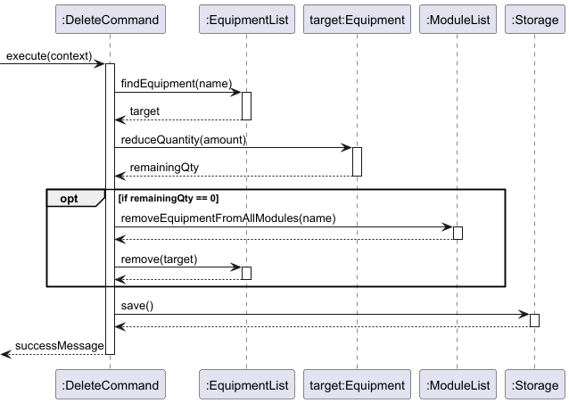
  <p><em>Figure 6: Sequence diagram of the Delete feature, highlighting the synchronous reverse-cleanup mechanism.</em></p>
</div>

#### 3. Design Considerations
* **Alternative 1 (Current): Hard Delete with Synchronous Cleanup**
  * *Justification*: Simplest for the user to understand. It ensures the `Storage` files remain compact, human-readable, and free of "ghost items."
* **Alternative 2: Soft Delete (Marking as "Inactive")**
  * *Rejection*: Increases storage complexity and clutters the UI. For a lab TA, "Delete" should mean the physical item is permanently gone from the lab's ledger.

#### 4. Current Limitations & Future Improvements
* *Limitation*: The command currently lacks an "undo" mechanism. If a user accidentally deletes an item, they must manually re-add and re-tag it.
* *Improvement*: Implement a recycle bin or an `undo` command stack in future versions to prevent accidental data loss.

---

### Storage Implementation

The Storage component manages data persistence using human-readable text files. This ensures that lab data is preserved across sessions without requiring a database engine.

#### 1. Data Format
Each entity is stored in a dedicated `.txt` file using the **Pipe-Delimited Format**.
* **Equipment (`equipment.txt`)**: `Name|Quantity|Loaned|MinQuantity|PurchaseSem|Lifespan|Buffer|ModuleTags`
* **Modules (`module.txt`)**: `ModuleCode|Pax`

#### 2. Loading Logic (The "Robust Loader")

<div align="center">
  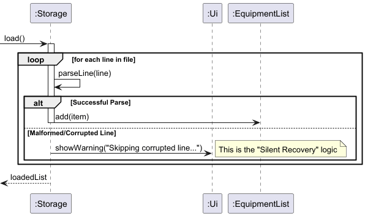
  <p><em>Figure 7: Sequence diagram demonstrating the "Silent Recovery" mechanism during Storage loading.</em></p>
</div>

During the initialization phase, the `Storage` class reads files line-by-line. To ensure system stability, it employs a **Silent Recovery** mechanism:
1.  It attempts to parse a line into a data object.
2.  If a line is malformed (e.g., missing a field or contains illegal characters), it catches the exception.
3.  The specific corrupted line is skipped, and a warning is issued via the `Ui`, but the rest of the file continues to load.

#### 3. Design Considerations
* **Alternative 1 (Current): Plain Text with Custom Delimiters**
  * **Justification**: It is extremely lightweight and requires zero external dependencies. Lab technicians can manually inspect or fix data using a simple text editor if necessary.
* **Alternative 2: JSON or XML**
  * **Rejection**: While more structured, these formats would require an external library (like Jackson or GSON) which adds complexity to the build process. For the current inventory scale, the overhead is not justified.

---

### SetBufferCommand

#### 1. Overview
The `SetBufferCommand` allows lab managers to configure a safety buffer percentage on an equipment item. This buffer is factored into the Procurement Report to ensure that recommended purchase quantities account for expected wear, breakage, or unexpected demand spikes, rather than relying solely on raw student enrollment figures.

#### 2. Implementation Details
The command supports targeting equipment by name (`n/`) or by 1-based list index (`i/`), and persists the updated buffer to storage immediately after execution.

**Format:**
- `setbuffer n/<name> b/<percentage>[%]` — targets equipment by name
- `setbuffer i/<index> b/<percentage>[%]` — targets equipment by 1-based list index

Execution flow:
1. The `Parser` processes the input and instantiates a `SetBufferCommand` with either the equipment name or index, and the buffer percentage value.
2. `SetBufferCommand#execute(Context)` is invoked.
3. The command retrieves the `EquipmentList` from the `Context` and resolves the target equipment by name or index.
4. If no match is found, an error message is displayed and execution halts with no state change.
5. If a match is found, `Equipment#setBufferPercentage(percentage)` is called to update the value.
6. `Storage#save()` is invoked to persist the change.
7. The `Ui` displays a confirmation message to the user.

**Parsing behaviour:**
- The `%` symbol in the buffer value is optional and is stripped during parsing before the value is stored.
- Negative buffer percentages are rejected with an error message.
- Specifying both `n/` and `i/` simultaneously is rejected with an error message.
- Buffer percentage defaults to `0.0` when equipment is first added.

**Example:**
```
setbuffer n/STM32 b/10%
setbuffer n/STM32 b/10
setbuffer i/1 b/10
```

#### 3. Sequence Diagram
*(Note: Storage persistence and UI confirmation steps are shown at a high level. The name/index-lookup logic within `EquipmentList` is abstracted for brevity.)*

<div align="center">
  
  <p><em>Figure 8: Sequence diagram showing the dual-targeting (name/index) execution flow for SetBufferCommand.</em></p>
</div>

#### 4. Design Considerations
* **Alternative 1 (Current Implementation): Dual Targeting (Name or Index)**
    * **How it works:** The `Parser` detects whether the input contains `n/` or `i/` to choose between name-based and index-based resolution.
    * **Why it was chosen:** Provides flexibility for both deliberate configuration (by name, which is explicit and unambiguous) and rapid access (by index, when the position is already known from a recent `list` output). This mirrors the dual-targeting approach used by `SetStatusCommand` for consistency across the command set.
* **Alternative 2: Name-Only Targeting**
    * **How it works:** The command would only accept `n/<name>` as the equipment identifier.
    * **Why it was rejected:** Requiring technicians to always type the full equipment name adds unnecessary friction when the index is already known. Eliminating the index option without justification would also create an inconsistent user experience across commands.

---

### SetStatusCommand

#### 1. Overview
The `SetStatusCommand` allows lab technicians to update the loaned or available count of an equipment item, reflecting real-time borrowing and return activity. It supports targeting equipment either by name or by 1-based list index, catering to both deliberate and rapid-entry workflows.

#### 2. Implementation Details
The command modifies the internal `loaned` and `available` counts of an `Equipment` object and persists the change immediately.

**Format:**
- `setstatus n/<name> q/<count> s/loaned` — loans out `<count>` units, decreasing available count
- `setstatus n/<name> q/<count> s/available` — returns `<count>` units, increasing available count
- `setstatus <index> q/<count> s/loaned` — same as above but targets by 1-based list index
- `setstatus <index> q/<count> s/available` — same as above but targets by 1-based list index

Execution flow:
1. The `Parser` processes the input and instantiates a `SetStatusCommand` with either a name or index, a count, and a direction (`loaned` or `available`).
2. `SetStatusCommand#execute(Context)` is invoked.
3. The command resolves the target `Equipment` from the `EquipmentList` using either the name or the index.
4. Input validation is performed: zero and negative counts are rejected with an error message, and the count is checked against the current available stock (when loaning) or current loaned stock (when returning) to prevent invalid states.
5. The appropriate counter is updated on the `Equipment` object.
6. `Storage#save()` is invoked to persist the change.
7. The `Ui` displays a confirmation message.

**Constraints:**
- Zero and negative counts are rejected with an error message — no change is made.
- Count must not exceed current available quantity when loaning out.
- Count must not exceed current loaned quantity when returning.

**Example:**
```
setstatus n/Basys3 FPGA q/5 s/loaned
setstatus 1 q/3 s/available
```

#### 3. Sequence Diagram
*(Note: The index-resolution and name-resolution paths share the same downstream logic once the target `Equipment` is identified. The diagram abstracts the branching lookup into a single `resolveTarget()` call for clarity.)*

<div align="center">
  
  <p><em>Figure 9: Sequence diagram illustrating the loan/available status update process.</em></p>
</div>

#### 4. Design Considerations
* **Alternative 1 (Current Implementation): Dual Targeting (Name or Index)**
    * **How it works:** The `Parser` detects whether the input contains `n/` to choose between name-based and index-based resolution.
    * **Why it was chosen:** During busy lab hours, a technician processing a queue of students can rapidly type `setstatus 1 q/3 s/loaned` without needing to recall the full equipment name. At the same time, name-based targeting remains available for unambiguous operations. Supporting both modes maximises throughput without sacrificing precision.
* **Alternative 2: Name-Only Targeting**
    * **How it works:** The command would only accept `n/<name>` as the equipment identifier.
    * **Why it was rejected:** Loan and return operations are the most frequent actions in the system, performed under time pressure. Forcing technicians to type full equipment names (which may be long, e.g., `Basys3 FPGA`) for every transaction would significantly slow down the workflow, directly undermining the CLI speed advantage that the application is designed to provide.

---

### Low Stock Alert System

#### 1. Overview
The Low Stock Alert system is a proactive inventory management feature designed to prevent laboratory equipment shortages. It allows lab managers to define a "Minimum Threshold" for any equipment item. The system automatically monitors inventory levels during transactions and issues a high-visibility warning (`!!! LOW STOCK ALERT`) if an action causes the stock to fall to or below the defined threshold.

#### 2. Implementation Details
The feature is integrated into the `Equipment` model and is triggered by the `DeleteCommand`, `SetStatusCommand`, and the `SetMinCommand`.

The execution flow follows these steps:
1. **Threshold Definition**: Each `Equipment` object maintains a `minQuantity` integer attribute.
2. **Configuration**: The user can set this threshold using the `setmin` command (e.g., `setmin 1 min/10`). The `SetMinCommand` validates the input and updates the `Equipment` object.
3. **Quantity Reduction**: When a user loans out an item (via `setstatus`) or removes items (via `delete`), the respective `Command` object updates the `Equipment` quantity.
4. **Logic Check**: Immediately after the update, the `Command` invokes `target.isBelowThreshold()`.
5. **UI Trigger**: If the check returns `true`, the `Command` calls `ui.showLowStockAlert(target)`, which displays the current stock levels and the required minimum to the user.

#### 3. Sequence Diagram
The following sequence diagram illustrates the interaction between the `DeleteCommand`, the `Equipment` model, and the `Ui` during a stock breach:

<div align="center">
  
  <p><em>Figure 10: Sequence diagram of the Low Stock Alert system triggering a UI warning post-transaction.</em></p>
</div>

#### 4. Design Considerations
**Alternative 1 (Current Implementation): Logic-Driven Alerts**
* **How it works:** The `Command` class acts as the controller, performing the threshold check after the data is modified and deciding whether to trigger the UI.
* **Why it was chosen:** It follows the **Separation of Concerns** principle. The `Equipment` class remains a pure data model, while the `Ui` handles presentation. This prevents the Model from being "tightly coupled" to the UI, making the system easier to maintain and test.

**Alternative 2: Model-Driven Auto-Alerts**
* **How it works:** The `Equipment#setQuantity()` method would automatically print a warning to the console if the new value is too low.
* **Why it was rejected:** This would force the `Equipment` class to depend on a UI component, which is poor architectural practice. It would also trigger unwanted alerts during "silent" operations, such as loading data from a save file on startup.

---

### Enhanced Find Feature

#### 1. Overview
The Enhanced Find Feature allows users to search the inventory not only by the equipment's name but also by its associated course module codes. This ensures that users can quickly locate all equipment required for a specific class (e.g., searching `find STM32 CG2111A` to retrieve all related microcontrollers and sensors).

#### 2. Implementation Details
The feature is facilitated by the `FindCommand` class. During a recent refactoring phase, the execution logic was heavily optimized to adhere to the **Single Level of Abstraction Principle (SLAP)**, purposefully eliminating deeply nested iterations (the "Arrow Anti-Pattern").

Execution flow:
1. The `Parser` processes the input and returns a `FindCommand` object containing the search tokens.
2. `FindCommand#execute(Context)` is invoked.
3. It calls a high-level helper `getMatchingEquipments(EquipmentList)` to iterate through the inventory.
4. The low-level string matching is delegated to `isMatchFound(...)`, which utilizes early returns.

**Code Snippet: SLAP and Early Returns**
As advised by clean code practices, we avoid deep nesting. The following minimal snippet demonstrates how `isMatchFound` safely halts execution upon the first match, preventing duplicate entries in the result list without relying on a `Set`:

```java
private boolean isMatchFound(Equipment eq, String[] tokens) {
  for (String token : tokens) {
    if (token.isEmpty()) {
      continue;
    }
    // Early return: As soon as we find one match, we return true.
    // This eliminates the need for the clunky "contains(eq) -> break" logic!
    if (matchesNameOrModule(eq, token)) {
      return true;
    }
  }
  return false;
}
```

#### 3. UML Diagrams
To illustrate this feature without cluttering a single diagram, the logic is divided into an Activity Diagram for the algorithmic flow and a Sequence Diagram using `ref` frames to abstract lower-level details.

**Activity Diagram: Iteration and Early Return**
*(This diagram omits UI rendering steps to focus purely on the search algorithm's fast-fail mechanism.)*

<div align="center">
  
  <p><em>Figure 11: Activity diagram showcasing the "Early Return" matching logic in the Find feature.</em></p>
</div>

**Sequence Diagram: Execution Flow**
*(Note: Minor parameter details are omitted as `...` for brevity. The low-level matching logic is abstracted into a `ref` frame.)*

<div align="center">
  
  <p><em>Figure 12: Sequence diagram detailing the iteration and abstraction levels of the FindCommand.</em></p>
</div>

#### 4. Design Considerations
* **Alternative 1 (Current Implementation): Extracted Helpers & Early Returns**
    * **Pros:** Highly performant ($O(1)$ addition check). The separation of concerns makes unit testing significantly easier.
    * **Cons:** Requires creating multiple private helper methods, slightly increasing class line count.
* **Alternative 2: Nested Iteration with `break` and `List.contains()`**
    * **Pros:** Keeps all logic inside a single method block.
    * **Cons:** Rejected due to the "Arrow Anti-Pattern". Relying on `ArrayList.contains(eq)` introduces an unnecessary $O(N)$ overhead per matched item.

#### 5. Current Limitations & Future Improvements
* *Limitation*: The search logic currently uses strict substring matching. It cannot handle minor spelling mistakes (e.g., searching for "oscilloscope" with a typo).
* *Improvement*: Implement fuzzy matching using Levenshtein distance to suggest closely named equipment when no exact match is found.

---

### Module Tracking System

#### 1. Overview
The Module Tracking System allows lab technicians to manage a central registry of academic course modules (e.g., `CG2111A`) and their respective student enrollment sizes (pax). This enhancement shifts the system from tracking isolated items to tracking items within their academic context, establishing the baseline required for accurate lab demand forecasting.

#### 2. Implementation Details
The core of the system is the `ModuleList` class, which manages a collection of `Module` entities. The system utilizes the **Context Object Pattern** to manage dependencies across all module-related commands, ensuring that the Logic component is cleanly decoupled from the Model and Storage components.

**Standard Operations (`addmod`, `delmod`, `listmod`):**
* **Add/Delete:** `AddModCommand` and `DelModCommand` extract the `ModuleList` and `Storage` from the unified `Context`. They modify the list (adding or removing a `Module` by its module code) and immediately invoke `Storage#saveModules()` to persist the state.
* **List:** `ListModCommand` retrieves the `ModuleList` from the `Context` and formats the current registry for the UI to display.

**Updating Module Details (`updatemod`):**
The `UpdateModCommand` is responsible for modifying the semantic metadata of a module, specifically updating the student enrollment size (`pax`).
When `updatemod n/CG2111A pax/180` is executed:
1. The command extracts the `ModuleList` from the `Context`.
2. It delegates the update to `ModuleList#updateModule(moduleName, newPax)`, which performs the lookup and applies the change internally.
3. Internally, the target `Module`'s enrollment size is updated via `Module#setPax(newPax)`.
4. `Storage#saveModules()` is invoked to persist the updated state.

**Code Snippet: Defensive Programming and Validation**
To demonstrate our adherence to defensive programming, the parsing and validation logic for `UpdateModCommand` ensures that critical metadata like `pax` cannot be set to invalid states (e.g., negative numbers) before the command is even instantiated:

```java
// Code Snippet: Defensive Programming and Validation in UpdateModCommand
public static UpdateModCommand parse(String fullCommand) throws EquipmentMasterException {
  // Strip the starting command word to isolate the arguments
  String args = fullCommand.replaceFirst("(?i)^updatemod\\s*", "").trim();

  Pattern pattern = Pattern.compile("n/(.+?)\\s+pax/(.+)");
  Matcher matcher = pattern.matcher(args);

  if (!matcher.matches()) {
    throw new EquipmentMasterException("Invalid command format. \nExpected: updatemod n/NAME pax/QTY");
  }

  String moduleName = matcher.group(1).trim();
  String paxString = matcher.group(2).trim();

  try {
    int pax = Integer.parseInt(paxString);
    if (pax < 0) {
      throw new EquipmentMasterException("Pax cannot be a negative number.");
    }
    return new UpdateModCommand(moduleName, pax);
  } catch (NumberFormatException e) {
    throw new EquipmentMasterException("Invalid pax value. Please enter a valid integer.");
  }
}
```

#### 3. UML Diagrams
To illustrate the data structure and execution flow of the Module Tracking System, we employ both a Class Diagram and a Sequence Diagram.

**Class Diagram: System Architecture**
*(Note: Minor exception classes and standard Java libraries are omitted. The diagram highlights the inheritance of commands and the normalized separation between the `ModuleList` and `Context`.)*

<div align="center">
  
  <p><em>Figure 13: Class diagram of the Module Tracking System architecture.</em></p>
</div>

**Sequence Diagram: Update Module Execution Flow**
*(Note: UI rendering steps and generic self-calls have been abstracted to focus on the core Model interactions during an update operation.)*

<div align="center">
  
  <p><em>Figure 14: Sequence diagram for updating academic module metadata (e.g., student pax).</em></p>
</div>

#### 4. Design Considerations
* **Alternative 1 (Current Implementation): Normalized Entity Structure**
  * **Design:** `Module` and `Equipment` are separate entities. `ModuleList` operates completely independently to track course enrollment details.
  * **Why it was chosen:** Adheres to database normalization principles. Updating a module's pax size via `UpdateModCommand` is handled centrally by `ModuleList` (an $O(M)$ lookup over modules followed by an $O(1)$ pax update), rather than requiring updates to be propagated across all equipment items. It lays the architectural groundwork for future features to cross-reference equipment with modules without data redundancy.
* **Alternative 2: Deeply Embedded Objects**
  * **Design:** Storing fully instantiated `Module` objects (including their `pax` values) inside every `Equipment` item.
  * **Why it was rejected:** Creates massive data redundancy. If a module's enrollment changes from 100 to 150, the system would have to perform an $O(N)$ traversal through the entire inventory to update every single piece of equipment associated with that module, risking severe state inconsistencies.

#### 5. Future Implementations (Beyond v2.1)
* **Automated Demand Forecasting:** Building upon the robust `pax` tracking established by `UpdateModCommand` and the existing mapping of equipment-usage ratios to modules (via the `tag`/`untag` commands and each `Module`’s equipment-requirement ratio map), future versions will use these mappings to automatically forecast total equipment demand per module and semester, cross-reference the expected totals against the actual available inventory, and surface forecasts and shortage warnings (e.g. via reports) before the semester begins.

---

### Academic Dependency Mapping (`TagCommand` & `UntagCommand`)

#### 1. Overview

The Academic Dependency Mapping system forms the critical bridge between the physical `EquipmentList` and the academic `ModuleList`. It allows technicians to define exact requirement ratios (e.g., 1 Soldering Iron shared per 5 students = `0.2`), which serves as the foundational data for the automated Procurement Report.

#### 2. Implementation Details

The `TagCommand` and `UntagCommand` heavily rely on defensive programming to maintain database integrity. The core mechanism is the **Double Ghost Reference Check**.

Execution flow of `TagCommand#execute(Context)`:

1.  **State Extraction:** The command retrieves both the `ModuleList` and `EquipmentList` from the `Context`.

2.  **Double Ghost Reference Check:** The system queries both lists to verify existence: `modules.hasModule(moduleName)` and `equipments.hasEquipment(equipmentName)`.

3.  **Target Resolution:** If either entity is missing, the operation is immediately aborted, throwing a detailed exception explaining exactly which entity (or both) is missing.

4.  **Canonical Naming:** To prevent case-sensitivity bugs during future data lookups, the command retrieves the _official_ capitalized name of the equipment from the `EquipmentList` rather than trusting the user's raw text input.

5.  **Mapping:** It updates the `Module`'s internal HashMap via `targetModule.addEquipmentRequirement(officialEquipmentName, requirementRatio)`.

6.  **Persistence:** It triggers `Storage#saveModules(modules)` to save the new relationship.

#### 3. Sequence Diagrams: Tag and Untag Execution
The following sequence diagrams illustrate the execution flow for the `TagCommand` and `UntagCommand`. Because these commands perform inverse operations, their execution paths are highly similar. They both locate a specific equipment item in the `EquipmentList`, modify its associated tags, and then trigger the `Storage` component to persist the updated state.

*(Note: The initial parsing of user input is omitted for clarity. Standard operations, such as index bounds-checking within the `EquipmentList` and the internal file writing mechanics of the `Storage` class, are abstracted to a high level.)*

**Tag Command Flow**

<div align="center">
  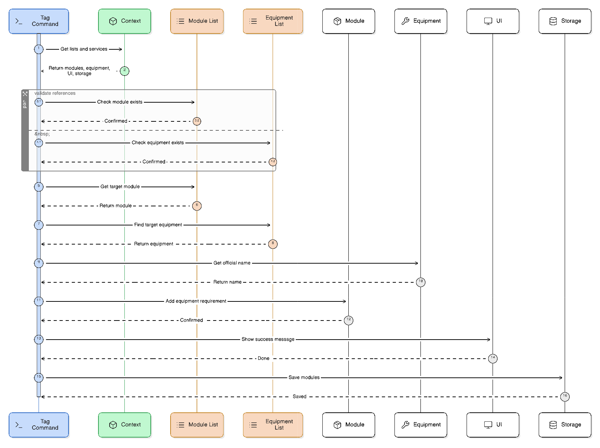
  <p><em>Figure 15: Sequence diagram illustrating the Academic Dependency Mapping (Tagging) process.</em></p>
</div>

**Untag Command Flow**

<div align="center">
  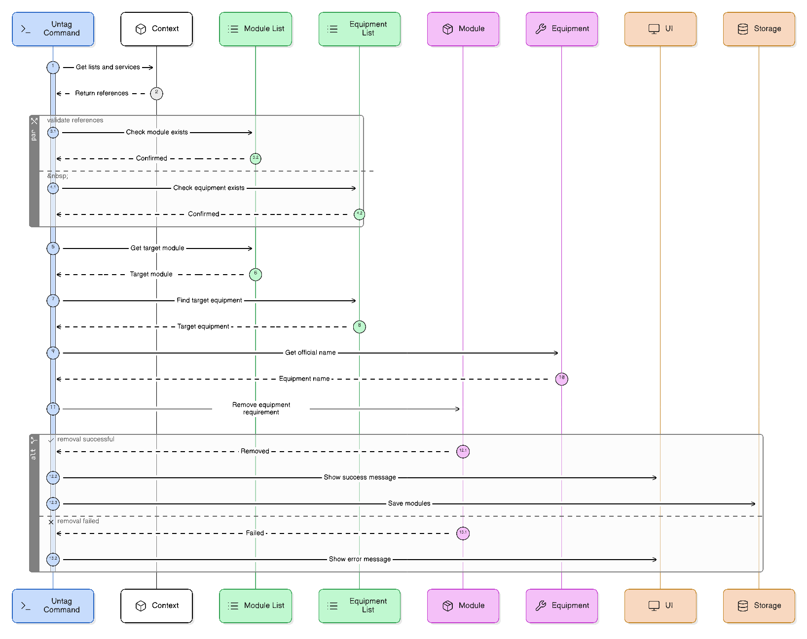
  <p><em>Figure 16: Sequence diagram showing the removal of a requirement ratio link.</em></p>
</div>

#### 4. Design Considerations

-   **Alternative 1 (Current Implementation): Strict Two-Way Validation**

  -   **Why it was chosen:** It strictly prevents orphaned data. By enforcing the Double Ghost Reference Check, a user cannot tag an equipment to a module that doesn't exist, nor can they mandate an equipment that the lab doesn't actually own. This guarantees that the Procurement Report's mathematical calculations will never encounter a `NullPointerException`.

-   **Alternative 2: Lazy Tagging (Create on Demand)**

  -   **Why it was rejected:** If a user made a typo (e.g., `tag m/CG2111A n/STM33`), a "lazy" system might automatically create a blank equipment profile for "STM33". This would pollute the lab's inventory database with ghost items and typos, completely destroying the integrity of the tracking system.

---

### Implementation: Safe Dereferencing (Data Integrity)

A critical challenge in the Academic Mapping system is maintaining data integrity when a primary entity (Equipment or Module) is deleted. The system employs a **Safe Dereferencing** strategy to prevent "Orphaned Tags" or `NullPointerExceptions` during report generation.

#### 1. Execution Logic
When a module is deleted (e.g., `delmod n/CG2111A`), the system ensures that no equipment remains "tagged" to a non-existent entity.

<div align="center">
  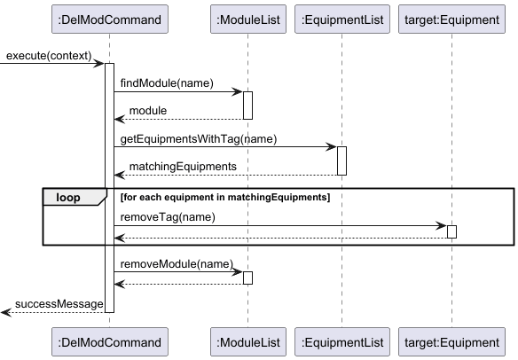
  <p><em>Figure 17: Sequence diagram of the Safe Dereferencing protocol during module deletion.</em></p>
</div>

1.  **Identification**: The `DelModCommand` queries the `EquipmentList` for any items containing the module code.
2.  **Cleanup**: It invokes `equipment.removeTag("CG2111A")` on each match.
3.  **Finalization**: Only after the `EquipmentList` is sanitized is the `Module` removed from the `ModuleList`.

#### 2. Design Considerations
* **Alternative 1 (Current): Synchronous Cleanup**
  * **Justification**: Guarantees that the `Procurement Report` will never encounter a missing reference. This "Eager" approach keeps the data files clean and easy to read manually.
* **Alternative 2: Lazy Cleanup (Cleanup during Report generation)**
  * **Rejection**: Increases the risk of inconsistent data if the reporting logic is interrupted. It also complicates the `Storage` component as it would have to handle "Ghost Tags" during loading.

---

### Aging Equipment Report

#### 1. Overview
The Aging Equipment Report feature empowers lab technicians to proactively audit inventory that has exceeded its expected lifespan. It calculates age dynamically based on the semantic university timeline (Academic Semesters) rather than absolute calendar dates.

#### 2. Implementation Details
Driven by the `ReportCommand`, this feature relies heavily on the `AcademicSemester` class to perform semantic time-difference calculations via the integrated `Context`.

During execution:
1.  The command retrieves the currently set `AcademicSemester` offset from the `Context` object.
2.  It iterates through the full `EquipmentList` in memory.
3.  For each item containing a `purchaseSemester`, the command invokes **`AcademicSemester#calculateAge(currentSemester)`** to resolve the elapsed time offset.
4.  If the resolved age is greater than or equal to the equipment’s designated `lifespan`, the command calls **`ReportCommand#addToReportList(equipment)`** to buffer the item.
5.  After the full iteration, the resulting results list is passed to the `UiTable` utility for dynamic rendering.

#### 3. UML Diagrams
**Sequence Diagram: Report Generation**
*(Note: Pseudocode like `calculate age` is used in place of exact mathematical method calls like `calculateAgeInYears()` to keep the diagram abstracted and focused on object interactions.)*

<div align="center">
  
  <p><em>Figure 18: Sequence diagram for generating the Aging Equipment Report.</em></p>
</div>

#### 4. Design Considerations
* **Alternative 1 (Current Implementation): Semantic Academic Timekeeping (`AY2024/25 Sem1`)**
    * **Justification:** Aligns with the domain reality of the target users. University procurement and auditing cycles operate on semesters, not strict DD/MM/YYYY formats. This greatly reduces friction during data entry.
* **Alternative 2: Standard `java.time.LocalDate`**
    * **Justification for rejection:** While standard, it forces users to guess exact dates (e.g., forcing a 1st Jan date if only the year is known), creating artificially precise but practically inaccurate data.

#### 5. Future Implementations (Beyond v2.1)
To further enhance the automated lab management experience, the following feature is planned for future iterations:
* **Automated Procurement Generation:** Building upon the Aging Equipment Report and the Module Tracking System (pax sizes), the system will hypothetically cross-reference aging items with next semester's expected student intake to automatically generate a formatted PDF "Purchase Request Form", detailing exactly how many new boards are needed to replace dead stock and meet student quotas.
<!-- @@author XiaoGeNekidora -->

---

### Implementation: Academic Semester Normalization

A core challenge in the `Aging Report` and `Procurement Report` is performing mathematical calculations on non-standard time formats like `AY2024/25 Sem1`.

#### 1. The Normalization Algorithm

<div align="center">
  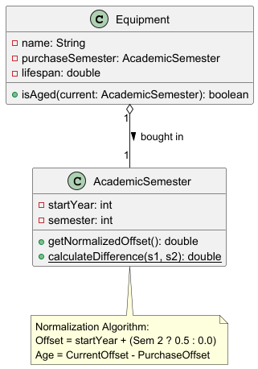
  <p><em>Figure 19: Class and logic diagram outlining the Academic Semester normalization algorithm.</em></p>
</div>

To compare two semesters or calculate the age of an item, the `AcademicSemester` class converts strings into a **Numeric Offset**.

**The Formula:**
`NormalizedValue = StartYear + (Semester == 2 ? 0.5 : 0.0)`

**Examples:**
* `AY2020/21 Sem1` -> `2020.0`
* `AY2020/21 Sem2` -> `2020.5`
* `AY2024/25 Sem1` -> `2024.0`

#### 2. Usage in Aging Calculation
To determine if an equipment is "Aged", the system calculates:
`CurrentAge = CurrentSemesterOffset - PurchaseSemesterOffset`
If `CurrentAge >= EquipmentLifespan`, the item is flagged.

This design converts a complex string-parsing problem into simple floating-point subtraction, ensuring the system is both performant and logically sound.

---

### Procurement Report (Automated Restocking)

#### 1. Overview
The Procurement Report is a computed report that calculates recommended semesterly purchase quantities. It aggregates demand from enrolled student numbers across different modules, applies a configured safety buffer, and compares the result against current stock to produce a "To Buy" list.

#### 2. Implementation Details
The feature is integrated into the existing `ReportCommand` class to group all analytical logic in one place. The core logic resides in the `executeProcurementReport(Context)` method.

The calculation follows this strict algorithm for each equipment item:
1.  **Demand Aggregation**: The system iterates through the `moduleCodes` list associated with the equipment. It retrieves the latest enrollment numbers (pax) from the `ModuleList` and sums them up to determine the `Base Demand`.
  *   *Orphaned Tag Handling*: If a module code exists in the equipment's tag list but has been deleted from the `ModuleList`, it is gracefully ignored to prevent `NullPointerException`.
2.  **Buffer Application**: The `Base Demand` is multiplied by `(1 + bufferPercentage / 100.0)`.
3.  **Indivisibility Rule**: The result is rounded up to the nearest whole number using `Math.ceil()`. You cannot purchase 0.5 of a board.
4.  **Gap Analysis**: The system subtracts the *Total Quantity* (owned inventory) from the *Total Required*.
  *   Note: It uses *Total Quantity* rather than *Available Quantity* because procurement decisions are based on total asset ownership, regardless of whether items are currently loaned out.
5.  **Output**: If `To Buy > 0`, the item is flagged in the report.

#### 3. Sequence Diagram: Procurement Report Execution
_(Note: The `getModuleByName` logic is represented as a self-invocation within the `ReportCommand`, and standard math calculations for demand are abstracted to focus on object interactions.)_

<div align="center">
  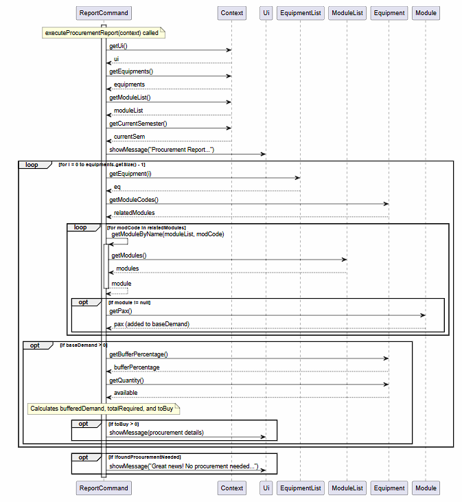
  <p><em>Figure 20: Sequence diagram showing the object interactions for generating the Procurement Report.</em></p>
</div>

#### 4. Design Considerations
**Alternative 1 (Current Implementation): Total Ownership vs. Demand**
*   **How it works:** `To Buy = Required - Total_Quantity`.
*   **Why it was chosen:** This is the correct accounting approach. If 10 items are needed, and we own 10 but 5 are loaned out, we do *not* need to buy more. We just need to wait for returns. Using `Available` would lead to massive over-purchasing during active semesters.

**Alternative 2: Available Stock vs. Demand**
*   **How it works:** `To Buy = Required - Available_Quantity`.
*   **Why it was rejected:** As mentioned above, this leads to double-purchasing. If an item is temporarily loaned, it is still an asset we own. Procurement budgets should only be spent on actual inventory deficits, not temporary shortages.

#### 5. The Calculation Pipeline
The Procurement Report is the most mathematically intensive feature of Equipment Master. It avoids floating-point errors and ensures realistic procurement values by following a strict rounding-up policy.

<div align="center">
  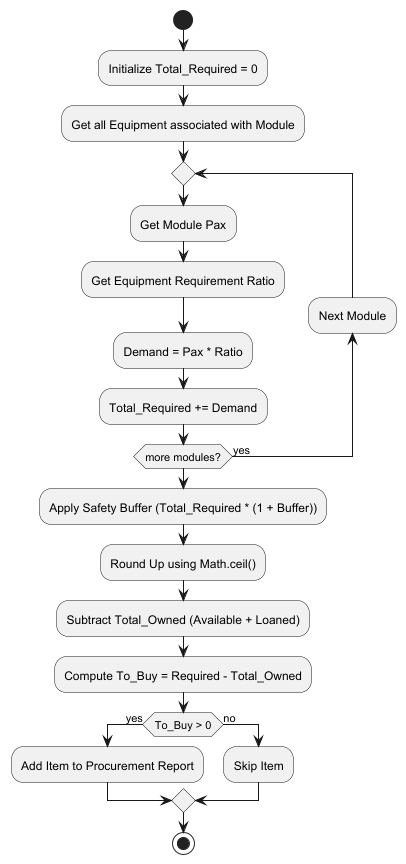
  <p><em>Figure 21: Activity diagram detailing the mathematical pipeline for the procurement calculation engine.</em></p>
</div>

**The Formula:**
`Recommended = ceil(Sum(Module_Pax * Requirement_Ratio) * (1 + Buffer)) - Total_Owned`

* **Indivisibility Rule**: The system applies `Math.ceil()` because lab equipment cannot be purchased in fractions.
* **Ownership Offset**: It subtracts `Total_Quantity` (Available + Loaned) because procurement represents long-term asset acquisition, not immediate shelf availability.

#### 6. Current Limitations & Future Improvements
* *Limitation*: The calculation assumes that all modules require the equipment simultaneously. It does not account for staggered lab schedules (e.g., Module A uses it in Weeks 1-6, Module B uses it in Weeks 7-13).
* *Improvement*: Introduce a "Usage Schedule" attribute to modules, allowing the procurement engine to calculate peak concurrent demand rather than absolute sum demand.

---

### `UiTable`: Dynamic UI Table Generation Utility

#### 1. Overview
As Equipment Master is a Command Line Interface (CLI) application, presenting structured data (such as inventory lists or command help tables) in a readable format is a significant challenge. The **Dynamic UI Table Generation** feature provides a reusable component `UiTable` and `UiTableRow` to automatically format and align variable-length data into neat, spreadsheet-like views. This component is heavily utilized by commands like `ListCommand` and `HelpCommand`.

#### 2. Implementation Details
The feature is implemented through two key classes in the `ui` package: `UiTable` and `UiTableRow`.

*   **`UiTableRow`**: Represents a single row of data. It serves as an adapter, accepting raw strings or domain objects (like `Equipment`) and converting them into a list of cell values. It also handles the low-level string padding logic.
*   **`UiTable`**: Acts as the layout engine. It collects multiple `UiTableRow` objects and calculates the maximum width required for each column by scanning all rows. This ensures that columns are perfectly aligned regardless of the data length.

When `ListCommand` is executed:
1.  It instantiates a new `UiTable`.
2.  It streams the `EquipmentList` and maps each `Equipment` object into a `UiTableRow`.
3.  Each row is added to the table.
4.  Finally, `table.toString()` is called. This triggers the calculation of column widths (`getColumnWidth`) and the generation of the final formatted string with indices and separators.

Similarly, `HelpCommand` utilizes `UiTable` but enables the `hasHeader` flag, allowing it to render a title row ("Command" | "Format") without the auto-generated numeric index.


#### Rendering Flow (Sequence Diagram)
The following sequence diagram illustrates how `ListCommand` utilizes `UiTable` to dynamically construct and format the inventory output before passing it to the `Ui` for display.

<div align="center">
  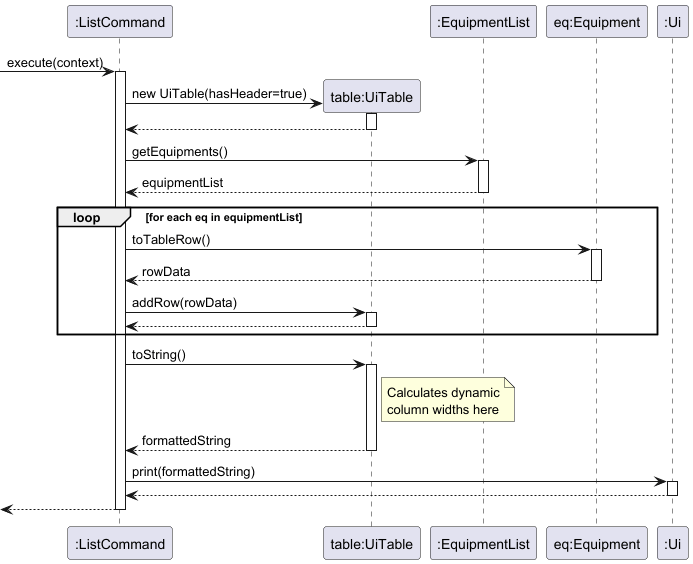
  <p><em>Figure 22: Sequence diagram illustrating how ListCommand utilizes UiTable for dynamic rendering.</em></p>
</div>

#### 3. Class Diagram

<div align="center">
  
  <p><em>Figure 23: Class diagram of the Dynamic UI Table Generation utility.</em></p>
</div>

#### 4. Design Considerations
**Alternative 1 (Current Implementation): Dynamic Column Width Calculation**
*   **How it works:** The `UiTable` calculates the required width for each column dynamically by iterating through all `UiTableRow` instances (via `getColumnWidth()`) to find the longest string in each column before generating the final formatted output.
*   **Why it was chosen:** It ensures perfect vertical alignment regardless of the data size while optimizing terminal space. It prevents data truncation for unusually long entries (like multiple module codes) and avoids massive gaps of whitespace when data entries are short. It also makes the table highly reusable for different types of data configurations.

**Alternative 2: Fixed Hardcoded Column Widths**
*   **How it works:** Pre-defining strict character limits for each column (e.g., allocating exactly 20 characters for the "Name" column and 15 characters for the "Lifespan" column).
*   **Why it was rejected:** It is rigid and prone to visual breakage. If an equipment name exceeds the fixed width, it either breaks the table alignment or requires complex text-wrapping/truncation logic. Additionally, it wastes horizontal screen real estate when dealing with consistently short data strings, making the UI feel cluttered and harder to read on smaller terminal windows.

---

<!-- @@author -->
### Help Feature

#### 1. Overview
The Help system provides an in-app reference for command syntax, reducing the user's reliance on external manuals. Instead of hardcoding a massive block of text, it dynamically generates the manual.

#### 2. Component-level implementation
The `HelpCommand` leverages the `UiTable` utility and the centralized `Parser` registry.

When executed, it retrieves the static list of `CommandSpec` objects from the `Parser`. It iterates through this registry, extracting the keyword and format string of every registered command, and maps them into `UiTableRow` objects to render a perfectly aligned table.

<div align="center">
  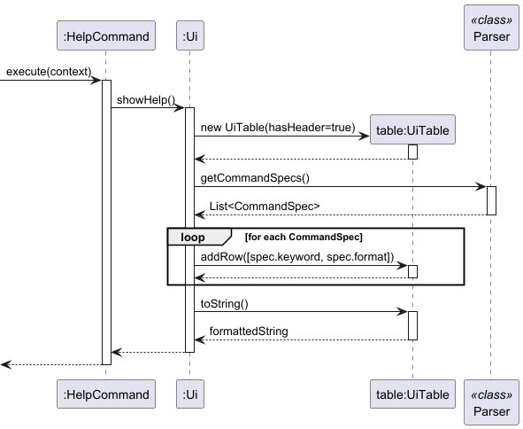
  <p><em>Figure 24: Sequence diagram showing the dynamic generation of the Help menu from the Parser registry.</em></p>
</div>

#### 3. Design Considerations
* **Alternative 1 (Current): Dynamic Table Generation**
  * *Justification*: Highly maintainable. When a developer adds a new command to the `Parser` registry, the `help` menu updates automatically. There is zero risk of the documentation falling out of sync with the codebase.
* **Alternative 2: Hardcoded String Block**
  * *Rejection*: Violates the DRY (Don't Repeat Yourself) principle. It would require developers to remember to update the `HelpCommand` string every time they modify a command's syntax elsewhere.

#### 4. Current Limitations & Future Improvements
* *Limitation*: The help menu displays all commands at once, which may push older messages out of the terminal buffer if the command list grows too large.
* *Improvement*: Support targeted help queries (e.g., `help add`) to display syntax and detailed examples for a specific command only.

---

### Logging Architecture

To facilitate debugging and system monitoring without polluting the user's Command Line Interface, Equipment Master utilizes the `java.util.logging.Logger` package.

#### 1. Implementation
* **Log File**: All log records are appended to a dedicated file (e.g., `equipment_master.log`), ensuring that the CLI remains clean for the user.
* **Initialization**: The logger is initialized globally upon application startup.
* **Log Levels Used**:
  * `INFO`: Used for tracking major system state changes (e.g., "Application started", "Storage file loaded successfully", "Procurement report generated").
  * `WARNING`: Used for recoverable errors (e.g., "Skipped corrupted line 4 in equipment.txt").
  * `SEVERE`: Used for critical failures that require application termination (e.g., "Failed to create data directory due to OS permission denial").

#### 2. Design Considerations
* **Why not use `System.out.println` for debugging?**
  * *Justification*: `System.out` mixes diagnostic data with the actual UI output, ruining the user experience. By routing diagnostic data to a `.log` file, developers can trace execution flows and post-mortem crashes asynchronously without breaking the CLI layout.

---

## Product scope
### Target user profile

Our primary target user is **Senior Lab Technicians** (e.g., Mr. Ho Fook Mun at the ECE Department). Their profile is defined by the following characteristics:
* **Environment:** Works in a fast-paced laboratory environment, frequently dealing with long queues of students borrowing equipment during peak periods (e.g., Week 4 of the semester).
* **Technical Preferences:** Highly proficient with a keyboard and prefers typing over using a mouse. Favors a Command Line Interface (CLI) because it allows for rapid, uninterrupted data entry compared to navigating through bulky graphical menus.
* **Core Pain Points:** 
  * Cannot quickly calculate total available stock versus loaned stock using paper logbooks.
  * Struggles to track which specific modules (e.g., EE2026, CG2111A) are consuming the most resources.
  * Relies on guesswork for end-of-semester budget declarations and procurement requests due to a lack of automated aging tracking.

### Value proposition

**Equipment Master** is a fast, text-based desktop application designed to digitize and streamline laboratory inventory management. Built specifically for university lab technicians managing high-traffic innovation spaces, it replaces fragile, error-prone paper logs with a secure, highly accountable digital system.

Whether you are managing shared pools of STM32 boards across different modules (e.g., EE2028, CG2028), allocating Basys3 boards for EE2026, or tracking general accessories like HDMI cables, Equipment Master ensures you always know exactly what you have and who has it.

**Why use Equipment Master?**
* **Ditch the Paper:** Transition from disorganized physical folders to a searchable, secure digital ledger.
* **Rapid CLI Workflow:** Designed for fast typists. Log check-outs and returns in seconds using simple text commands, avoiding clunky GUI menus.
* **Module-Specific Tracking:** Easily associate equipment with specific academic modules to track usage and allocations accurately.
* **100% Accountability:** Precisely track borrower identities and monitor equipment availability to eliminate the loss of high-value lab assets.

---

## User Stories

| Priority | As a ... | I want to ... | So that I can ... |
|----------|----------|---------------|-------------------|
| *** | first-time user | view document/help information of each command | see the command syntax without looking up an external manual. |
| *** | first-time user | receive a clear text error message | know exactly which part of my command was wrong and correct it immediately. |
| *** | technician | add a new type of equipment | catalog new inventory arrivals and start tracking them. |
| *** | technician | delete a specific quantity of equipment | ensure the inventory reflects the actual physical stock after loss or damage. |
| *** | technician | see a list of all equipment items | view data that is aligned and readable even in a terminal window. |
| *** | technician | update the quantity of a specific item | reflect the current physical stock after a shipment or inventory adjustment. |
| *** | technician | set the status of equipment to available/loaned | check what items are currently with students and what are still in the lab. |
| *** | technician | exit the application safely using a command | ensure the application closes gracefully after I finish my work. |
| *** | technician | input student numbers (pax) for each module | allow the system to establish the baseline for equipment demand forecasting. |
| *** | technician | update the student enrollment (pax) of an existing module | adjust to changing class sizes without re-entering all the module data. |
| *** | technician | delete a module from the registry | clean up the database safely without accidentally deleting physical equipment records. |
| ** | technician | view a summary list of all registered modules | quickly verify which courses the lab is supporting this semester. |
| ** | lab manager | tag equipment with Module Codes (e.g., EE2026) | calculate stock shortages specific to each course, rather than just total count. |
| ** | lab manager | untag equipment from a module | accurately reflect syllabus changes if a course stops using a specific hardware. |
| ** | technician | use the search command with a keyword or module code | locate specific items or all items assigned to a module (e.g., `CG2111A`) instantly. |
| ** | technician | set a "minimum quantity" threshold for critical items | receive immediate alerts when stock runs low before I completely run out. |
| ** | technician | generate a "Low Stock Report" | get a filtered view of all items that are currently below their safety threshold. |
| ** | technician | set the current academic semester (e.g., `AY25/26 Sem1`) | ensure all aging and procurement reports are calculated against a correct timeline. |
| ** | technician | view the currently set academic semester | verify the system's time context before generating reports. |
| ** | lab manager | view an "Aging Report" based on purchase date and lifespan | identify "High Risk" boards that are likely to fail and need replacement. |
| ** | lab manager | set a "Safety Buffer" percentage for procurement | ensure the purchase recommendation includes extra spares for unexpected damage. |
| ** | lab manager | generate a "Procurement Report" | mathematically prove to the department how many new units we need to buy for the next semester. |
| * | technician | link an item to a specific student ID | keep a strict record and never forget which student loaned which specific piece of equipment. |
| * | technician | link an item to a specific lab or physical place | easily remember where the equipment is physically located in the real world. |
| * | technician | add, rename, or delete labs/places in the system | maintain an accurate digital map of the lab's physical logistics infrastructure. |
| * | technician | bulk move all items from one lab to another lab | quickly reflect large-scale physical equipment relocations in the software. |
| * | technician | view a history of repairs for a specific board type | identify if a specific batch of boards is defective and should be returned to the vendor. |
| * | lab manager | record all operations in an audit log and view the log | ensure accountability by tracking who performed which action and when. |
| * | technician | start a "Stocktake Mode" to verify items shelf-by-shelf | reconcile the system's data with actual physical inventory annually. |
| * | expert user | use flags (e.g., `list --available --stm32`) to filter the list | refine the inventory view instantly without seeing irrelevant items. |
| * | lab manager | export data to an Excel or CSV sheet | generate files compatible with department-level reporting and archiving. |
| * | expert user | view and use command history | quickly repeat the last transaction without re-typing the entire command. |
| * | expert user | use shortcuts or aliases to execute commands | skip confirmation prompts and perform routine actions much faster. |
| * | expert user | batch process loans via barcode scanning or file input | handle 50+ loans at once during peak hours without manual entry. |
| * | expert user | perform multiple actions using chain commands | execute complex operational sequences in a single line of instruction. |
| * | expert user | toggle verbose mode off (Quiet Mode) | keep the terminal screen clean and focused during rapid, repetitive tasks. |
| * | lab manager | auto-generate a Budget Request email text | simply copy-paste the system's procurement data directly into an email to the boss. |
| * | lab manager | filter inventory by "Remaining Lifespan" | identify exactly which batch of boards needs to be phased out by next year. |

**Note on Priorities:**
* `***` = **High** (Core CRUD operations and fundamental tracking, must-have for basic lab operations).
* `**` = **Medium** (Relational tagging and analytical reports, should-have for semester planning).
* `*` = **Low** (Advanced utilities and Future Roadmap features, nice-to-have for expert efficiency).

---

### Use Cases

(For all use cases below, the **System** is `Equipment Master` and the **Actor** is the `Lab Technician`, unless specified otherwise)

**Use case: UC01 - Tag equipment to an academic module**

**MSS (Main Success Scenario)**
1. User requests to tag an equipment to a module by providing the module code, equipment name, and requirement ratio.
2. System checks the `ModuleList` and verifies the module exists.
3. System checks the `EquipmentList` and verifies the equipment exists.
4. System calculates and formats the official canonical names.
5. System registers the requirement ratio inside the target module.
6. System saves the updated module registry to storage.
7. System displays a success confirmation message.
   Use case ends.

**Extensions**
* 2a. The given module code does not exist in the registry.
  * 2a1. System displays a "Module Not Found" error.
  * Use case ends.
* 3a. The given equipment name does not exist in the inventory.
  * 3a1. System displays an "Equipment Not Found" error.
  * Use case ends.

**Use case: UC02 - Generate Procurement Report**

**MSS**
1. User requests to generate the procurement report.
2. System iterates through all equipment in the inventory.
3. For each equipment, System cross-references tagged modules and fetches their student enrollment (pax).
4. System calculates the base demand and applies the equipment's safety buffer.
5. System rounds up the demand to the nearest whole integer.
6. System subtracts the total owned physical stock from the required demand.
7. System formats all items with a "To Buy" value > 0 into a `UiTable`.
8. System displays the formatted report.
   Use case ends.

**Extensions**
* 2a. The inventory is completely empty.
  * 2a1. System displays an empty inventory message.
  * Use case ends.
* 7a. No equipment falls below the required threshold (nothing to buy).
  * 7a1. System displays a "No procurement needed" message.
  * Use case ends.

---

## Non-Functional Requirements (NFR)

1.  **Platform Independence**: The application must run on Windows, macOS, and Linux with **Java 17** or higher installed.
2.  **Performance**: The system must respond to any search or list command within **100ms**, even with an inventory size of 1,000+ items.
3.  **Resilience**: The system must not crash upon encountering a corrupted line in the storage file; it should log a warning and skip the line.
4.  **Hermetic Testing**: All automated tests must use JUnit 5 `@TempDir` to ensure zero impact on the user's actual data files.
5.  **No Network Dependency**: The system must function 100% offline to ensure data privacy in secure lab environments.
6.  **Atomic Persistence**: Every save operation must overwrite the storage file entirely to prevent partial-write corruption.

---

## Glossary

* **CLI (Command Line Interface):** A text-based user interface used to interact with software and operating systems by typing commands.
* **Equipment:** A physical asset in the laboratory (e.g., STM32 board, Basys3 FPGA, Oscilloscope) managed by the system.
* **Module:** An academic course offered by the university (e.g., `CG2111A`, `EE2026`).
* **Pax:** The total number of students enrolled in a specific module.
* **Academic Semester (AY):** The semantic time format used to track equipment age (e.g., `AY24/25 Sem1`).
* **Safe Dereferencing:** The automated process of unlinking an equipment from a module when that module is deleted, ensuring the equipment record itself is not accidentally destroyed.

---

## Instructions for Manual Testing

Given below are instructions to manually test the application.

### 1. Launch and Initialization
1. **Initial launch:** Download the latest `EquipmentMaster.jar` file and copy it into an empty folder.
2. Open a command terminal in that folder and run the command: `java -jar EquipmentMaster.jar`.
  * **Expected:** The application launches successfully, displaying a welcome message and an empty inventory list. A new `data` folder is automatically created in the same directory.

### 2. Loading Sample Data
To test the system with pre-populated data without typing everything manually:
1. Close the application if it is running.
2. Navigate to the newly created `data` folder.
3. Replace the contents of the auto-generated storage files (e.g., `equipment.txt`, `module.txt`) with valid sample data provided by the development team.
4. Relaunch the application.
  * **Expected:** The system loads the sample data successfully, and typing `list` or `listmod` displays the populated items.

### 3. Testing the Enhanced Find Feature
1. **Prerequisite:** Ensure the system has at least one equipment tagged to a module (e.g., "STM32" tagged to "CG2111A").
2. **Test Case:** Type `find CG2111A` and press Enter.
  * **Expected:** The system returns a list of all equipment associated with that module, even if the equipment name itself does not contain the string "CG21".
3. **Test Case:** Type `find nonExistentItem`.
  * **Expected:** The system displays a message indicating that 0 items were found.

### 4. Testing the Aging Equipment Report
1. **Prerequisite:** Ensure the inventory contains equipment with different `purchaseSemester` values (some older than their `lifespan`, some newer).
2. **Setup Context:** Type `setsem AY2025/26 Sem1` (or any future semester to simulate time passing) to set the system's current academic context.
  * **Expected:** The system confirms the current semester has been updated.
3. **Test Case:** Type `report aging` and press Enter.
  * **Expected:** The system uses the currently set academic semester (from `Context#getCurrentSemester()`) to calculate ages, and prints a formatted list of *only* the equipment that has exceeded or reached its expected lifespan.

### 5. Testing the Module Tracking System
1. **Adding a Module:**
  * **Test Case:** Type `addmod n/CS2113 pax/150` and press Enter.
  * **Expected:** System successfully adds the module `CS2113` with a student capacity of 150.
2. **Listing Modules:**
  * **Test Case:** Type `listmod` and press Enter.
  * **Expected:** Displays a formatted list of all registered modules, including `CS2113`.
3. **Updating Module Pax:**
  * **Test Case:** Type `updatemod n/CS2113 pax/200`.
  * **Expected:** The student enrollment size for `CS2113` is updated to 200. Verification can be done by typing `listmod` again.
4. **Deleting a Module:**
  * **Test Case:** Type `delmod n/CS2113`.
  * **Expected:** The module `CS2113` is removed from the system. (Safe dereferencing ensures no equipment is deleted).

### 6. Testing Equipment Core Operations (CRUD)
1. **Adding Equipment:**
  * **Test Case:** Type `add n/Oscilloscope q/10 bought/AY2024/25 Sem1 min/2 life/5`.
  * **Expected:** The equipment "Oscilloscope" is added with an available quantity of 10.
2. **Listing Equipment:**
  * **Test Case:** Type `list`.
  * **Expected:** Displays the full inventory list.
3. **Deleting Equipment:**
  * **Test Case:** Type `delete n/Oscilloscope q/2 s/AVAILABLE` (or use index: `delete 1 q/2 s/AVAILABLE`).
  * **Expected:** The available quantity of the Oscilloscope is reduced by 2.

### 7. Testing Status, Thresholds, and Buffers
1. **Setting Equipment Status:**
  * **Test Case:** Type `setstatus n/Oscilloscope q/3 s/LOANED`.
  * **Expected:** 3 Oscilloscopes are moved from "AVAILABLE" to "LOANED" status.
2. **Setting Minimum Threshold:**
  * **Test Case:** Type `setmin n/Oscilloscope min/5`.
  * **Expected:** The minimum threshold for Oscilloscope is updated to 5.
3. **Setting Buffer Percentage:**
  * **Test Case:** Type `setbuffer n/Oscilloscope b/15`.
  * **Expected:** The safety buffer for Oscilloscope is updated to 15%.

### 8. Testing Additional Reports
1. **Low Stock Report:**
  * **Prerequisite:** Ensure at least one item's total quantity is strictly less than its minimum threshold (e.g., total quantity=3, min=5), regardless of how many units are currently LOANED vs AVAILABLE.
  * **Test Case:** Type `report lowstock`.
  * **Expected:** System lists only the items whose total quantity has fallen below their set minimum threshold (loaned-vs-available is ignored), alerting the technician of shortages.
2. **Procurement Report:**
  * **Test Case:** Type `report procurement`.
  * **Expected:** System calculates and displays a formatted report suggesting how many new units need to be purchased based on current stock, buffers, and module demands.

### 9. Testing Relational Mapping
1. **Tagging Equipment to a Module:**
  * **Prerequisite:** Ensure `CG2111A` (Module) and `STM32` (Equipment) exist.
  * **Test Case:** Type `tag m/CG2111A n/STM32 req/0.5`.
  * **Expected:** The system links STM32 to CG2111A with a requirement ratio of 0.5.
2. **Untagging Equipment:**
  * **Test Case:** Type `untag m/CG2111A n/STM32`.
  * **Expected:** The relational link between the module and the equipment is removed.

### 10. Testing Utilities and Context
1. **Checking Current Semester:**
  * **Test Case:** Type `getsem`.
  * **Expected:** System displays the currently active academic semester.
2. **Help Command:**
  * **Test Case:** Type `help`.
  * **Expected:** System outputs a summary of all available commands and their syntax.
3. **Exiting the Application:**
  * **Test Case:** Type `bye`.
  * **Expected:** System displays a farewell message and the application terminates gracefully.

### 11. Testing Robustness (Negative Cases)

#### 11.1 Invalid Data Input
* **Test Case**: `add n/Item q/abc` (Invalid quantity type)
* **Expected**: Error message: "Quantity must be a valid positive integer." No item is added.
* **Test Case**: `tag m/NON_EXISTENT n/STM32` (Missing module)
* **Expected**: Error message: "Module NON_EXISTENT not found in registry."

#### 11.2 Storage Corruption Recovery
1. Open `data/equipment.txt` and add a blank line between two items.
2. Relaunch the application.
* **Expected**: The system should skip the blank line, load all valid items, and NOT crash.

#### 11.3 Boundary Values
* **Test Case**: `setstatus 1 q/999 s/loaned` (Loan more than available)
* **Expected**: Error message indicating insufficient stock. In-memory quantity remains unchanged.

---

## Future Roadmap (Beyond v2.1)

1.  **Automated Audit Logs**: Implement a `history` command to track every transaction with a timestamp to enhance lab accountability.
2.  **Fuzzy Search**: Enhance the `find` command with Levenshtein Distance algorithms to suggest the correct equipment name if the user makes a minor typo.
3.  **Batch Processing**: Support for reading multiple commands from a `.csv` file for high-volume start-of-semester equipment intake.
4.  **Export Utility**: Add a command to export reports (Aging/Procurement) into `.csv` format for integration with University financial systems.

---

## Appendix: Project Effort

While this project was built upon the architectural foundations taught in CS2113, the development of **Equipment Master** required significant effort to move beyond a simple "flat-list" address book into a **relational database management tool**.

Key technical challenges our team overcame include:
1. **Relational Data Mapping (Many-to-Many)**: Unlike standard address books where an item exists in isolation, our system links physical `Equipment` to abstract `Modules`. We had to engineer a safe cross-referencing system (Safe Dereferencing) to ensure data integrity during deletions, preventing ghost references.
2. **Dynamic UI Rendering**: Creating the `UiTable` utility required developing an algorithm that pre-scans all generic row data to calculate dynamic column widths. This ensures perfect alignment in the CLI without hardcoding string lengths.
3. **Advanced Algorithmic Forecasting**: The `Procurement Report` is not a simple filter. It is an algorithmic engine that aggregates pax, ratios, applies percentage buffers, handles mathematical ceiling logic, and offsets against total ownership.
4. **Semantic Time Parsing**: We replaced standard `java.time` libraries with a custom `AcademicSemester` parser to evaluate equipment aging based on university lifecycles (e.g., `AY24/25 Sem1`), requiring custom string extraction and floating-point normalization.