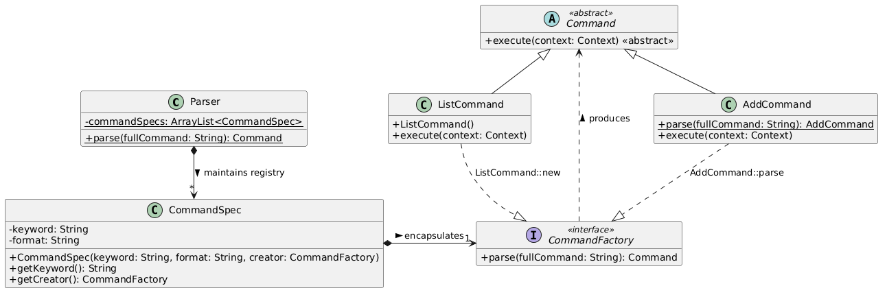
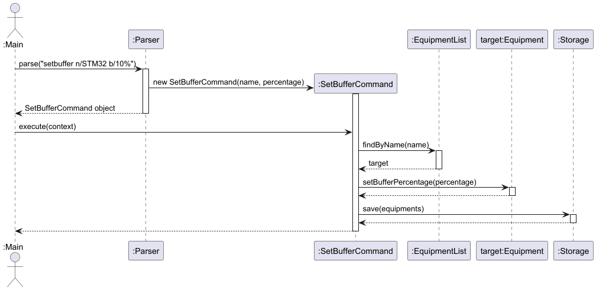
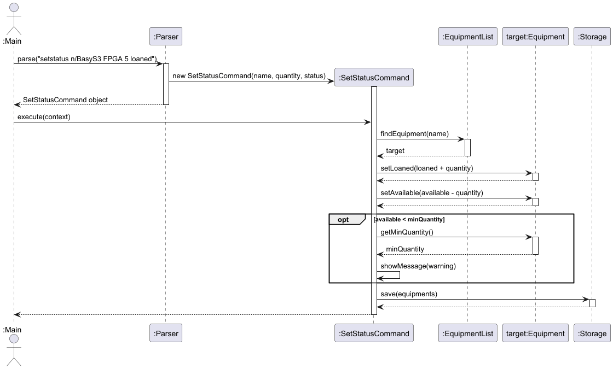
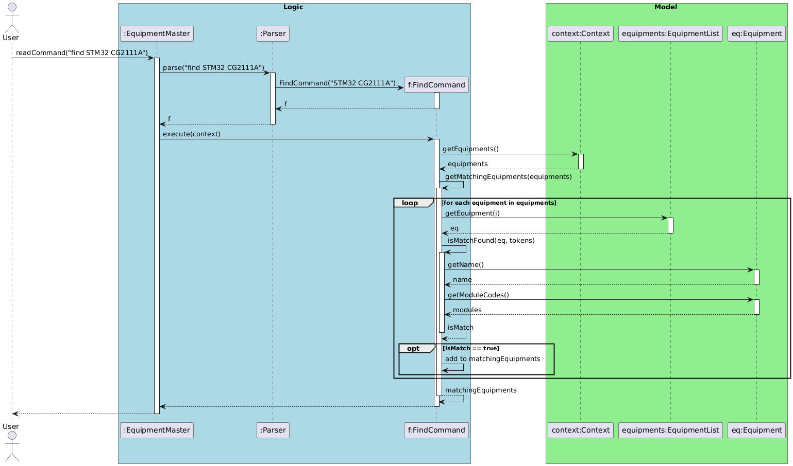
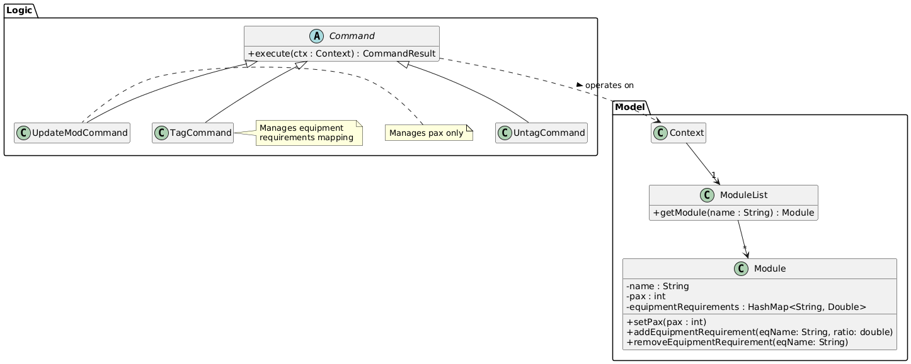
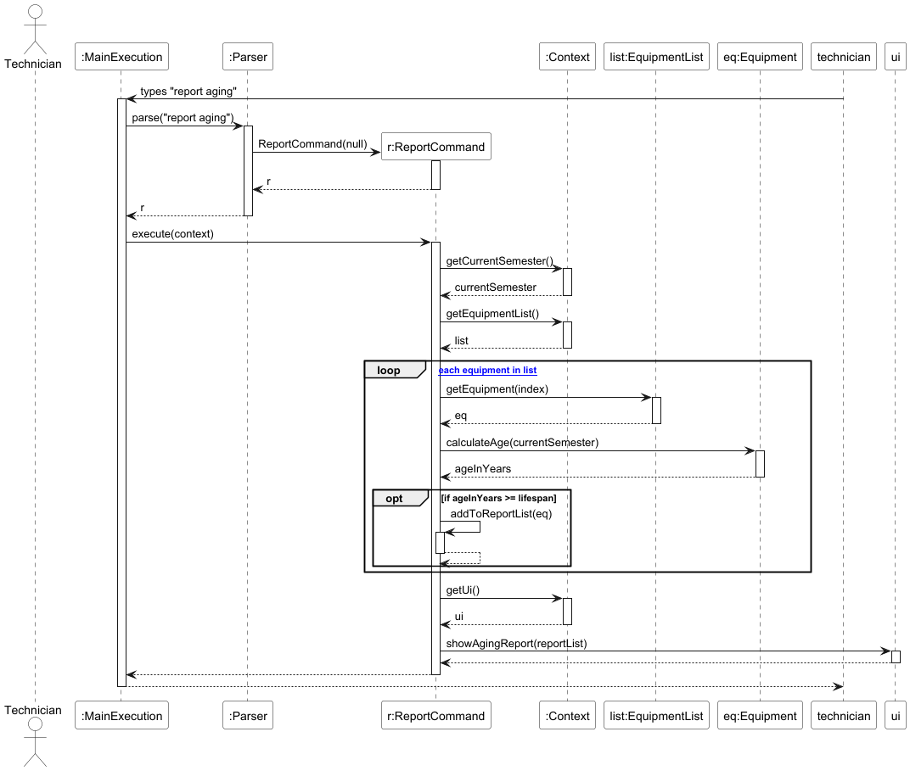
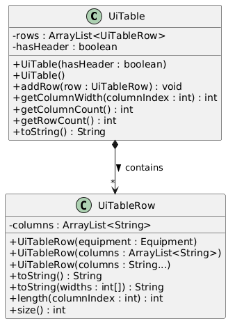

# Developer Guide

## Acknowledgements

* **AddressBook-Level3 (AB3):** This project was initially inspired by and adapted from the AddressBook-Level3 project created by the [SE-EDU initiative](https://se-education.org). We thank the AB3 team for providing a robust architectural template for Java-based CLI applications.
* **Libraries Used:** 
  * [JUnit 5](https://junit.org/junit5/) - For comprehensive unit and integration testing.

## Design & implementation

### Parser Component (Command Factory Pattern)

#### 1. Overview
The `Parser` component acts as the primary gateway for processing user input into executable `Command` objects. It is designed using the **Command Factory Pattern** to ensure high scalability and adherence to the **Open-Closed Principle**.

Developers adding new CLI commands to the application do not need to modify the core parsing loop; they only need to register their new command via a `CommandSpec`.

#### 2. Architecture and Usage
The architecture abstracts the knowledge of *which* command is being requested from *how* that command is parsed and instantiated.

**Key Components:**
1. `CommandFactory` (Functional Interface): Defines a single `parse(String fullCommand)` method signature. Every command class must implement its own parsing logic that matches this signature (typically as a static method).
2. `CommandSpec`: A data class that bundles a command's trigger `keyword` (e.g., `"add"`), its usage `format` string (used primarily by the `help` command), and an instance of `CommandFactory`.
3. `Parser`: Maintains a static, centralized registry (`ArrayList<CommandSpec> commandSpecs`) of all available commands.

**How to Add a New Command:**
When creating a new feature, a developer must:
1. Create the new `Command` class.
2. If the command requires arguments, implement a `public static Command parse(String fullCommand)` method within that class to handle regex validation and argument extraction.
3. Open `Parser.java` and navigate to the static initialization block.
4. Register the new command by adding a `CommandSpec` utilizing Java method references.

**Code Snippet: Command Registration**
```java
static {
    // Registering a Complex Command (requires validation and extraction)
    commandSpecs.add(new CommandSpec("add", "add n/NAME q/QUANTITY...", AddCommand::parse));
    
    // Registering a Simple Command (no arguments needed)
    commandSpecs.add(new CommandSpec("list", "list", fullCommand -> new ListCommand()));
}
```

#### 3. UML Class Diagram


#### 4. Design Considerations
* **Command Factory Pattern & Registration**
    * **Justification:** It provides excellent extensibility. By encapsulating parsing and data validation within the specific command classes themselves (e.g., `AddCommand::parse`), the central `Parser` class remains clean. This entirely eliminates bloated dependencies and monolithic `switch-case` statements, heavily reducing merge conflicts when multiple developers add commands simultaneously.

---

### SetBufferCommand

Sets a buffer percentage on a named equipment item. The buffer is persisted to storage.



**Format:** `setbuffer n/<name> b/<percentage>[%]`

**Behaviour:**
- The `%` symbol in the buffer value is optional and stripped during parsing
- If the equipment name is not found, an error message is shown and no change is made
- Buffer percentage defaults to `0.0` when equipment is first added

**Example:**
```
setbuffer n/STM32 b/10%
setbuffer n/STM32 b/10
```
 
---

### SetStatusCommand

Updates the loaned or available count of an equipment item. Can target equipment by name or by 1-based index.



**Format:**
- `setstatus n/<name> <count> loaned` — loans out `<count>` units, decreasing available
- `setstatus n/<name> <count> available` — returns `<count>` units, increasing available
- `setstatus <index> <count> loaned/available` — same as above but targets by 1-based list index

**Constraints:**
- Negative counts are rejected silently — no change is made
- Count must not exceed current available (when loaning) or current loaned (when returning)

**Example:**
```
setstatus n/BasyS3 FPGA 5 loaned
setstatus 1 3 available
```

---

### Low Stock Alert System

#### 1. Overview
The Low Stock Alert system is a proactive inventory management feature designed to prevent laboratory equipment shortages. It allows lab managers to define a "Minimum Threshold" for any equipment item. The system automatically monitors inventory levels during transactions and issues a high-visibility warning (`!!! LOW STOCK ALERT`) if an action causes the stock to fall to or below the defined threshold.

#### 2. Implementation Details
The feature is integrated into the `Equipment` model and is triggered by the `DeleteCommand`, `SetStatusCommand`, and the `SetMinCommand`.

The execution flow follows these steps:
1. **Threshold Definition**: Each `Equipment` object maintains a `minQuantity` integer attribute.
2. **Configuration**: The user can set this threshold using the `setmin` command (e.g., `setmin 1 min/10`). The `SetMinCommand` validates the input and updates the `Equipment` object.
3. **Quantity Reduction**: When a user loans out an item (via `setstatus`) or removes items (via `delete`), the respective `Command` object updates the `Equipment` quantity.
4. **Logic Check**: Immediately after the update, the `Command` invokes `target.isBelowThreshold()`.
5. **UI Trigger**: If the check returns `true`, the `Command` calls `ui.showLowStockAlert(target)`, which displays the current stock levels and the required minimum to the user.

#### 3. Sequence Diagram
The following sequence diagram illustrates the interaction between the `DeleteCommand`, the `Equipment` model, and the `Ui` during a stock breach:


#### 4. Design Considerations
**Alternative 1 (Current Implementation): Logic-Driven Alerts**
* **How it works:** The `Command` class acts as the controller, performing the threshold check after the data is modified and deciding whether to trigger the UI.
* **Why it was chosen:** It follows the **Separation of Concerns** principle. The `Equipment` class remains a pure data model, while the `Ui` handles presentation. This prevents the Model from being "tightly coupled" to the UI, making the system easier to maintain and test.

**Alternative 2: Model-Driven Auto-Alerts**
* **How it works:** The `Equipment#setQuantity()` method would automatically print a warning to the console if the new value is too low.
* **Why it was rejected:** This would force the `Equipment` class to depend on a UI component, which is poor architectural practice. It would also trigger unwanted alerts during "silent" operations, such as loading data from a save file on startup.

---

### Enhanced Find Feature

#### 1. Overview
The Enhanced Find Feature allows users to search the inventory not only by the equipment's name but also by its associated course module codes. This ensures that users can quickly locate all equipment required for a specific class (e.g., searching `find STM32 CG2111A` to retrieve all related microcontrollers and sensors).

#### 2. Implementation Details
The feature is facilitated by the `FindCommand` class. During a recent refactoring phase, the execution logic was heavily optimized to adhere to the **Single Level of Abstraction Principle (SLAP)**, purposefully eliminating deeply nested iterations (the "Arrow Anti-Pattern").

Execution flow:
1. The `Parser` processes the input and returns a `FindCommand` object containing the search tokens.
2. `FindCommand#execute(Context)` is invoked.
3. It calls a high-level helper `getMatchingEquipments(EquipmentList)` to iterate through the inventory.
4. The low-level string matching is delegated to `isMatchFound(...)`, which utilizes early returns.

**Code Snippet: SLAP and Early Returns**
As advised by clean code practices, we avoid deep nesting. The following minimal snippet demonstrates how `isMatchFound` safely halts execution upon the first match, preventing duplicate entries in the result list without relying on a `Set`:

```java
private boolean isMatchFound(Equipment eq, String[] tokens) {
  for (String token : tokens) {
    if (token.isEmpty()) {
      continue;
    }
    // Early return: As soon as we find one match, we return true.
    // This eliminates the need for the clunky "contains(eq) -> break" logic!
    if (matchesNameOrModule(eq, token)) {
      return true;
    }
  }
  return false;
}
```

#### 3. UML Diagrams
To illustrate this feature without cluttering a single diagram, the logic is divided into an Activity Diagram for the algorithmic flow and a Sequence Diagram using `ref` frames to abstract lower-level details.

**Activity Diagram: Iteration and Early Return**
*(This diagram omits UI rendering steps to focus purely on the search algorithm's fast-fail mechanism.)*


**Sequence Diagram: Execution Flow**
*(Note: Minor parameter details are omitted as `...` for brevity. The low-level matching logic is abstracted into a `ref` frame.)*


#### 4. Design Considerations
* **Alternative 1 (Current Implementation): Extracted Helpers & Early Returns**
    * **Pros:** Highly performant ($O(1)$ addition check). The separation of concerns makes unit testing significantly easier.
    * **Cons:** Requires creating multiple private helper methods, slightly increasing class line count.
* **Alternative 2: Nested Iteration with `break` and `List.contains()`**
    * **Pros:** Keeps all logic inside a single method block.
    * **Cons:** Rejected due to the "Arrow Anti-Pattern". Relying on `ArrayList.contains(eq)` introduces an unnecessary $O(N)$ overhead per matched item.

---

### Module Tracking System

#### 1. Overview
The Module Tracking System allows lab technicians to manage a central registry of academic course modules (e.g., `CG2111A`) and their respective student enrollment sizes (pax). This enhancement shifts the system from tracking isolated items to tracking items within their academic context, establishing the baseline required for accurate lab demand forecasting.

#### 2. Implementation Details
The core of the system is the `ModuleList` class, which manages a collection of `Module` entities. The system utilizes the **Context Object Pattern** to manage dependencies across all module-related commands, ensuring that the Logic component is cleanly decoupled from the Model and Storage components.

**Standard Operations (`addmod`, `delmod`, `listmod`):**
* **Add/Delete:** `AddModCommand` and `DelModCommand` extract the `ModuleList` and `Storage` from the unified `Context`. They modify the list (adding or removing a `Module` by its module code) and immediately invoke `Storage#saveModules()` to persist the state.
* **List:** `ListModCommand` retrieves the `ModuleList` from the `Context` and formats the current registry for the UI to display.

**Updating Module Details (`updatemod`):**
The `UpdateModCommand` is responsible for modifying the semantic metadata of a module, specifically updating the student enrollment size (`pax`).
When `updatemod n/CG2111A pax/180` is executed:
1. The command extracts the `ModuleList` from the `Context`.
2. It delegates the update to `ModuleList#updateModule(moduleName, newPax)`, which performs the lookup and applies the change internally.
3. Internally, the target `Module`'s enrollment size is updated via `Module#setPax(newPax)`.
4. `Storage#saveModules()` is invoked to persist the updated state.

**Code Snippet: Defensive Programming and Validation**
To demonstrate our adherence to defensive programming, the parsing and validation logic for `UpdateModCommand` ensures that critical metadata like `pax` cannot be set to invalid states (e.g., negative numbers) before the command is even instantiated:

```java
// Code Snippet: Defensive Programming and Validation in UpdateModCommand
public static UpdateModCommand parse(String fullCommand) throws EquipmentMasterException {
  // Strip the starting command word to isolate the arguments
  String args = fullCommand.replaceFirst("(?i)^updatemod\\s*", "").trim();

  Pattern pattern = Pattern.compile("n/(.+?)\\s+pax/(.+)");
  Matcher matcher = pattern.matcher(args);

  if (!matcher.matches()) {
    throw new EquipmentMasterException("Invalid command format. \nExpected: updatemod n/NAME pax/QTY");
  }

  String moduleName = matcher.group(1).trim();
  String paxString = matcher.group(2).trim();

  try {
    int pax = Integer.parseInt(paxString);
    if (pax < 0) {
      throw new EquipmentMasterException("Pax cannot be a negative number.");
    }
    return new UpdateModCommand(moduleName, pax);
  } catch (NumberFormatException e) {
    throw new EquipmentMasterException("Invalid pax value. Please enter a valid integer.");
  }
}
```

#### 3. UML Diagrams
To illustrate the data structure and execution flow of the Module Tracking System, we employ both a Class Diagram and a Sequence Diagram.

**Class Diagram: System Architecture**
*(Note: Minor exception classes and standard Java libraries are omitted. The diagram highlights the inheritance of commands and the normalized separation between the `ModuleList` and `Context`.)*


**Sequence Diagram: Update Module Execution Flow**
*(Note: UI rendering steps and generic self-calls have been abstracted to focus on the core Model interactions during an update operation.)*


#### 4. Design Considerations
* **Alternative 1 (Current Implementation): Normalized Entity Structure**
  * **Design:** `Module` and `Equipment` are separate entities. `ModuleList` operates completely independently to track course enrollment details.
  * **Why it was chosen:** Adheres to database normalization principles. Updating a module's pax size via `UpdateModCommand` is handled centrally by `ModuleList` (an $O(M)$ lookup over modules followed by an $O(1)$ pax update), rather than requiring updates to be propagated across all equipment items. It lays the architectural groundwork for future features to cross-reference equipment with modules without data redundancy.
* **Alternative 2: Deeply Embedded Objects**
  * **Design:** Storing fully instantiated `Module` objects (including their `pax` values) inside every `Equipment` item.
  * **Why it was rejected:** Creates massive data redundancy. If a module's enrollment changes from 100 to 150, the system would have to perform an $O(N)$ traversal through the entire inventory to update every single piece of equipment associated with that module, risking severe state inconsistencies.

#### 5. Future Implementations (Beyond v2.1)
* **Automated Demand Forecasting:** Building upon the robust `pax` tracking established by `UpdateModCommand` and the existing mapping of equipment-usage ratios to modules (via the `tag`/`untag` commands and each `Module`’s equipment-requirement ratio map), future versions will use these mappings to automatically forecast total equipment demand per module and semester, cross-reference the expected totals against the actual available inventory, and surface forecasts and shortage warnings (e.g. via reports) before the semester begins.

---

### Aging Equipment Report

#### 1. Overview
The Aging Equipment Report feature empowers lab technicians to proactively audit inventory that has exceeded its expected lifespan. It calculates age dynamically based on the semantic university timeline (Academic Semesters) rather than absolute calendar dates.

#### 2. Implementation Details
Driven by the `ReportCommand`, this feature relies heavily on the `AcademicSemester` class to perform semantic time-difference calculations.

During execution:
1. The command retrieves the current `AcademicSemester` from the environment.
2. It iterates through the `EquipmentList`.
3. For items with a `purchaseSemester`, it calculates the elapsed time.
4. Equipments exceeding their designated `lifespan` are compiled into a report.

#### 3. UML Diagrams
**Sequence Diagram: Report Generation**
*(Note: Pseudocode like `calculate age` is used in place of exact mathematical method calls like `calculateAgeInYears()` to keep the diagram abstracted and focused on object interactions.)*


#### 4. Design Considerations
* **Alternative 1 (Current Implementation): Semantic Academic Timekeeping (`AY2024/25 Sem1`)**
    * **Justification:** Aligns with the domain reality of the target users. University procurement and auditing cycles operate on semesters, not strict DD/MM/YYYY formats. This greatly reduces friction during data entry.
* **Alternative 2: Standard `java.time.LocalDate`**
    * **Justification for rejection:** While standard, it forces users to guess exact dates (e.g., forcing a 1st Jan date if only the year is known), creating artificially precise but practically inaccurate data.

#### 5. Future Implementations (Beyond v2.1)
To further enhance the automated lab management experience, the following feature is planned for future iterations:
* **Automated Procurement Generation:** Building upon the Aging Equipment Report and the Module Tracking System (pax sizes), the system will hypothetically cross-reference aging items with next semester's expected student intake to automatically generate a formatted PDF "Purchase Request Form", detailing exactly how many new boards are needed to replace dead stock and meet student quotas.
<!-- @@author XiaoGeNekidora -->

---

### Procurement Report (Automated Restocking)

#### 1. Overview
The Procurement Report is a computed report that calculates recommended semesterly purchase quantities. It aggregates demand from enrolled student numbers across different modules, applies a configured safety buffer, and compares the result against current stock to produce a "To Buy" list.

#### 2. Implementation Details
The feature is integrated into the existing `ReportCommand` class to group all analytical logic in one place. The core logic resides in the `executeProcurementReport(Context)` method.

The calculation follows this strict algorithm for each equipment item:
1.  **Demand Aggregation**: The system iterates through the `moduleCodes` list associated with the equipment. It retrieves the latest enrollment numbers (pax) from the `ModuleList` and sums them up to determine the `Base Demand`.
  *   *Orphaned Tag Handling*: If a module code exists in the equipment's tag list but has been deleted from the `ModuleList`, it is gracefully ignored to prevent `NullPointerException`.
2.  **Buffer Application**: The `Base Demand` is multiplied by `(1 + bufferPercentage / 100.0)`.
3.  **Indivisibility Rule**: The result is rounded up to the nearest whole number using `Math.ceil()`. You cannot purchase 0.5 of a board.
4.  **Gap Analysis**: The system subtracts the *Total Quantity* (owned inventory) from the *Total Required*.
  *   Note: It uses *Total Quantity* rather than *Available Quantity* because procurement decisions are based on total asset ownership, regardless of whether items are currently loaned out.
5.  **Output**: If `To Buy > 0`, the item is flagged in the report.

#### 3. Design Considerations
**Alternative 1 (Current Implementation): Total Ownership vs. Demand**
*   **How it works:** `To Buy = Required - Total_Quantity`.
*   **Why it was chosen:** This is the correct accounting approach. If 10 items are needed, and we own 10 but 5 are loaned out, we do *not* need to buy more. We just need to wait for returns. Using `Available` would lead to massive over-purchasing during active semesters.

**Alternative 2: Available Stock vs. Demand**
*   **How it works:** `To Buy = Required - Available_Quantity`.
*   **Why it was rejected:** As mentioned above, this leads to double-purchasing. If an item is temporarily loaned, it is still an asset we own. Procurement budgets should only be spent on actual inventory deficits, not temporary shortages.

---

### `UiTable`: Dynamic UI Table Generation Utility

#### 1. Overview
As Equipment Master is a Command Line Interface (CLI) application, presenting structured data (such as inventory lists or command help tables) in a readable format is a significant challenge. The **Dynamic UI Table Generation** feature provides a reusable component `UiTable` and `UiTableRow` to automatically format and align variable-length data into neat, spreadsheet-like views. This component is heavily utilized by commands like `ListCommand` and `HelpCommand`.

#### 2. Implementation Details
The feature is implemented through two key classes in the `ui` package: `UiTable` and `UiTableRow`.

*   **`UiTableRow`**: Represents a single row of data. It serves as an adapter, accepting raw strings or domain objects (like `Equipment`) and converting them into a list of cell values. It also handles the low-level string padding logic.
*   **`UiTable`**: Acts as the layout engine. It collects multiple `UiTableRow` objects and calculates the maximum width required for each column by scanning all rows. This ensures that columns are perfectly aligned regardless of the data length.

When `ListCommand` is executed:
1.  It instantiates a new `UiTable`.
2.  It streams the `EquipmentList` and maps each `Equipment` object into a `UiTableRow`.
3.  Each row is added to the table.
4.  Finally, `table.toString()` is called. This triggers the calculation of column widths (`getColumnWidth`) and the generation of the final formatted string with indices and separators.

Similarly, `HelpCommand` utilizes `UiTable` but enables the `hasHeader` flag, allowing it to render a title row ("Command" | "Format") without the auto-generated numeric index.

#### 3. Class Diagram


---

<!-- @@author -->
## Product scope
### Target user profile

Our primary target user is **Senior Lab Technicians** (e.g., Mr. Ho Fook Mun at the ECE Department). Their profile is defined by the following characteristics:
* **Environment:** Works in a fast-paced laboratory environment, frequently dealing with long queues of students borrowing equipment during peak periods (e.g., Week 4 of the semester).
* **Technical Preferences:** Highly proficient with a keyboard and prefers typing over using a mouse. Favors a Command Line Interface (CLI) because it allows for rapid, uninterrupted data entry compared to navigating through bulky graphical menus.
* **Core Pain Points:** 
  * Cannot quickly calculate total available stock versus loaned stock using paper logbooks.
  * Struggles to track which specific modules (e.g., EE2026, CG2111A) are consuming the most resources.
  * Relies on guesswork for end-of-semester budget declarations and procurement requests due to a lack of automated aging tracking.

### Value proposition

**Equipment Master** is a fast, text-based desktop application designed to digitize and streamline laboratory inventory management. Built specifically for university lab technicians managing high-traffic innovation spaces, it replaces fragile, error-prone paper logs with a secure, highly accountable digital system.

Whether you are managing shared pools of STM32 boards across different modules (e.g., EE2028, CG2028), allocating Basys3 boards for EE2026, or tracking general accessories like HDMI cables, Equipment Master ensures you always know exactly what you have and who has it.

**Why use Equipment Master?**
* **Ditch the Paper:** Transition from disorganized physical folders to a searchable, secure digital ledger.
* **Rapid CLI Workflow:** Designed for fast typists. Log check-outs and returns in seconds using simple text commands, avoiding clunky GUI menus.
* **Module-Specific Tracking:** Easily associate equipment with specific academic modules to track usage and allocations accurately.
* **100% Accountability:** Precisely track borrower identities and monitor equipment availability to eliminate the loss of high-value lab assets.

## User Stories

| Version | As a ... | I want to ... | So that I can ... |
|---------|----------|---------------|-------------------|
| **v1.0** | new technician | view a list of all available commands | quickly learn how to operate the system without memorizing the user guide. |
| **v1.0** | lab technician | add a new equipment item to the inventory | maintain an up-to-date digital record of all lab assets. |
| **v1.0** | lab technician | update the status of an equipment to "loaned" | hold students accountable and know exactly what is currently out of the lab. |
| **v1.0** | lab technician | delete a broken or lost equipment from the system | ensure the inventory count reflects the actual usable stock. |
| **v2.0** | lab manager | search for equipment by its assigned module code (e.g., `CG2111A`) | quickly retrieve all development boards and sensors required for an upcoming class session. |
| **v2.0** | lab manager | register a new academic module and its expected student pax | establish a baseline for how much equipment will be demanded this semester. |
| **v2.0** | lab technician | generate an aging equipment report | proactively identify devices that have exceeded their lifespan and justify budget requests for replacements. |
| **v2.0** | power user | link a specific equipment requirement ratio to a module | automatically scale and forecast the lab's inventory needs when student enrollment sizes change. |

## Non-Functional Requirements

1. **Environment:** The system should work seamlessly on any mainstream Operating System (Windows, macOS, Linux) that has **Java 17** or above installed.
2. **Performance:** The system should respond to standard user commands (e.g., adding, finding, or listing items) within 100 milliseconds to support rapid typing during busy lab hours.
3. **Data Storage:** Data should be stored locally in human-editable text files (e.g., `.txt` or `.json`). The system should not rely on an external Database Management System (DBMS) or require an active internet connection, ensuring the lab can operate even during network outages.
4. **Data Integrity:** If the local data file is manually corrupted by a user (e.g., invalid formatting), the system should gracefully detect the error on startup and load an empty inventory rather than crashing outright.
5. **Usability:** A user with above-average typing speed should be able to accomplish standard inventory tasks noticeably faster using the CLI than they would using a traditional mouse-driven GUI.

## Glossary

* **CLI (Command Line Interface):** A text-based user interface used to interact with software and operating systems by typing commands.
* **Equipment:** A physical asset in the laboratory (e.g., STM32 board, Basys3 FPGA, Oscilloscope) managed by the system.
* **Module:** An academic course offered by the university (e.g., `CG2111A`, `EE2026`).
* **Pax:** The total number of students enrolled in a specific module.
* **Academic Semester (AY):** The semantic time format used to track equipment age (e.g., `AY24/25 Sem1`).
* **Safe Dereferencing:** The automated process of unlinking an equipment from a module when that module is deleted, ensuring the equipment record itself is not accidentally destroyed.

## Instructions for Manual Testing

Given below are instructions to manually test the application.

### 1. Launch and Initialization
1. **Initial launch:** Download the latest `EquipmentMaster.jar` file and copy it into an empty folder.
2. Open a command terminal in that folder and run the command: `java -jar EquipmentMaster.jar`.
  * **Expected:** The application launches successfully, displaying a welcome message and an empty inventory list. A new `data` folder is automatically created in the same directory.

### 2. Loading Sample Data
To test the system with pre-populated data without typing everything manually:
1. Close the application if it is running.
2. Navigate to the newly created `data` folder.
3. Replace the contents of the auto-generated storage files (e.g., `equipment.txt`, `module.txt`) with valid sample data provided by the development team.
4. Relaunch the application.
  * **Expected:** The system loads the sample data successfully, and typing `list` or `listmod` displays the populated items.

### 3. Testing the Enhanced Find Feature
1. **Prerequisite:** Ensure the system has at least one equipment tagged to a module (e.g., "STM32" tagged to "CG2111A").
2. **Test Case:** Type `find CG2111A` and press Enter.
  * **Expected:** The system returns a list of all equipment associated with that module, even if the equipment name itself does not contain the string "CG21".
3. **Test Case:** Type `find nonExistentItem`.
  * **Expected:** The system displays a message indicating that 0 items were found.

### 4. Testing the Aging Equipment Report
1. **Prerequisite:** Ensure the inventory contains equipment with different `purchaseSemester` values (some older than their `lifespan`, some newer).
2. **Setup Context:** Type `setsem AY25/26 Sem1` (or any future semester to simulate time passing) to set the system's current academic context.
  * **Expected:** The system confirms the current semester has been updated.
3. **Test Case:** Type `report aging` and press Enter.
  * **Expected:** The system uses the currently set academic semester (from `Context#getCurrentSemester()`) to calculate ages, and prints a formatted list of *only* the equipment that has exceeded or reached its expected lifespan.